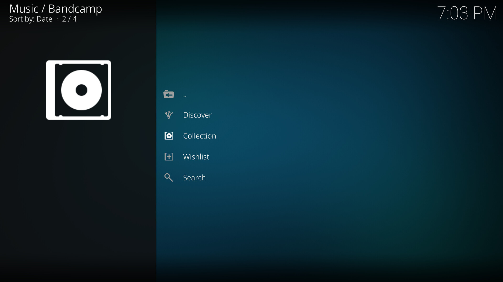
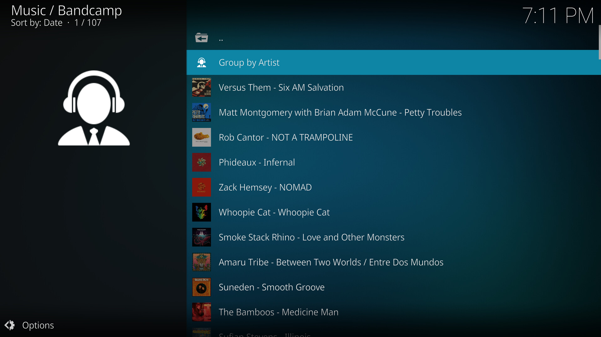
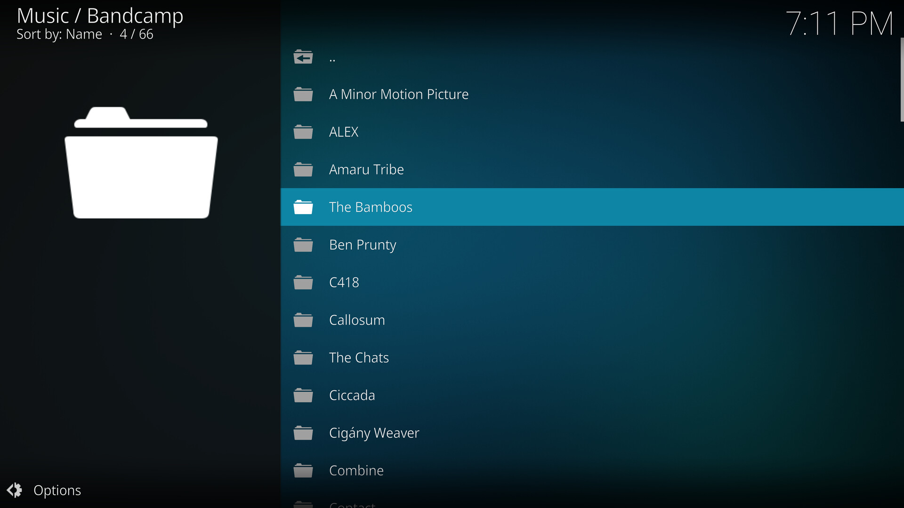
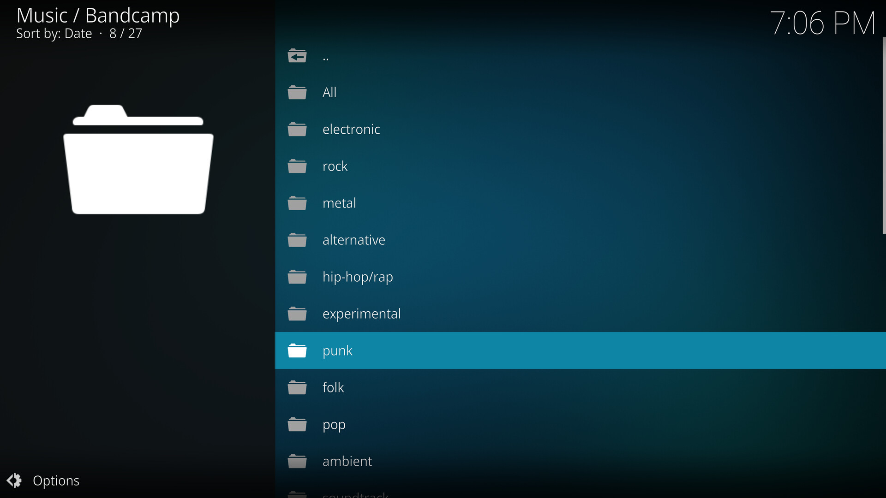
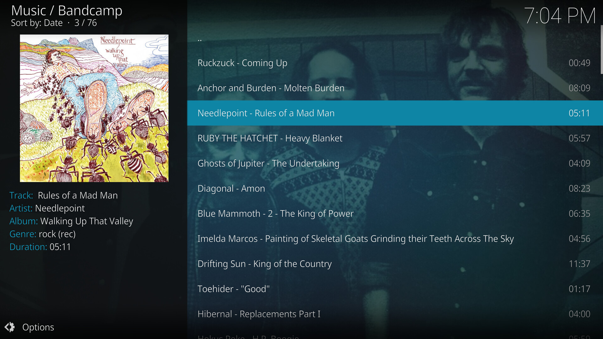

# plugin.audio.kxmxpxtx.bandcamp
Bandcamp (https://bandcamp.com) on Kodi Media Player. Currently possible to get featured tracks from discovery and browse own collection.

Thanks @Virusmater for creating this plugin! This is a continuation of [the original plugin](https://github.com/Virusmater/plugin.audio.kxmxpxtx.bandcamp).

Uses [this python bandcamp wrapper](https://github.com/Virusmater/bandcamp_api) with some modifications.

Support bands you like!

# Screenshots
## Menu

## Collection
Album view:

Group by Artist:

## Discover
Genres:

Tracks within genre:

# Installation
You can install [the published add-on](https://kodi.tv/addons/matrix/plugin.audio.kxmxpxtx.bandcamp) through Kodi.

Alternatively, you can download a zip file of this repository, and manually add it to Kodi.

# todo
* add caches collection and fan\_id
* add possibility to listen to all bands and albums in the collection
* add setting for discovery playlist size
* add personal mix (e.g top punk-hardcore + new black metal)
