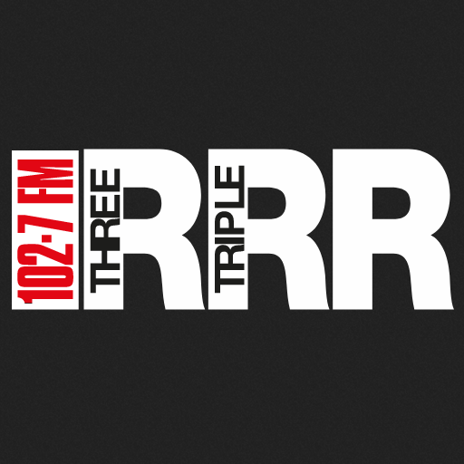
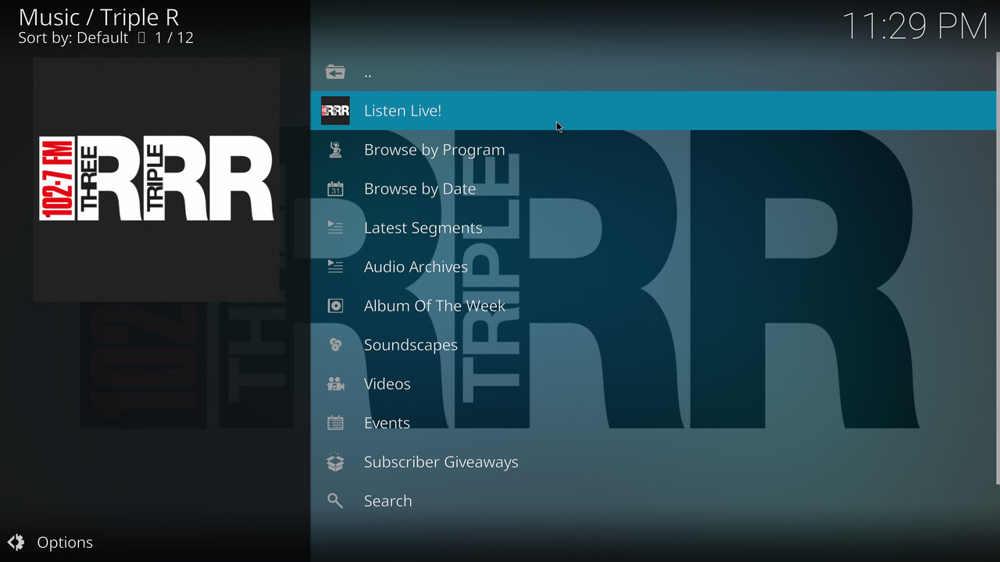
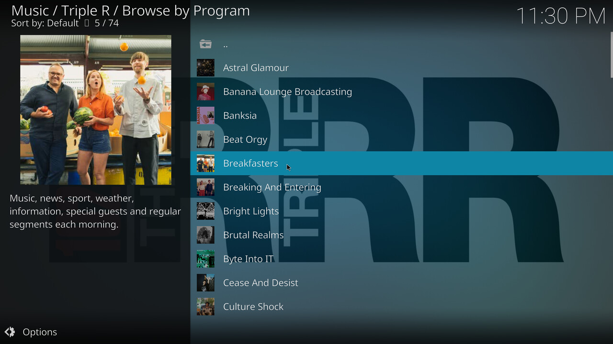
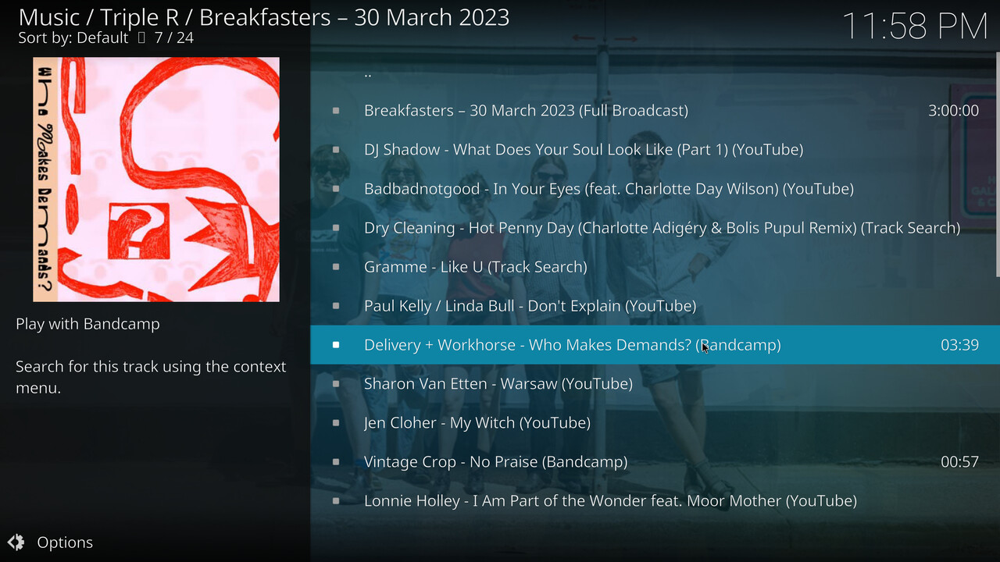
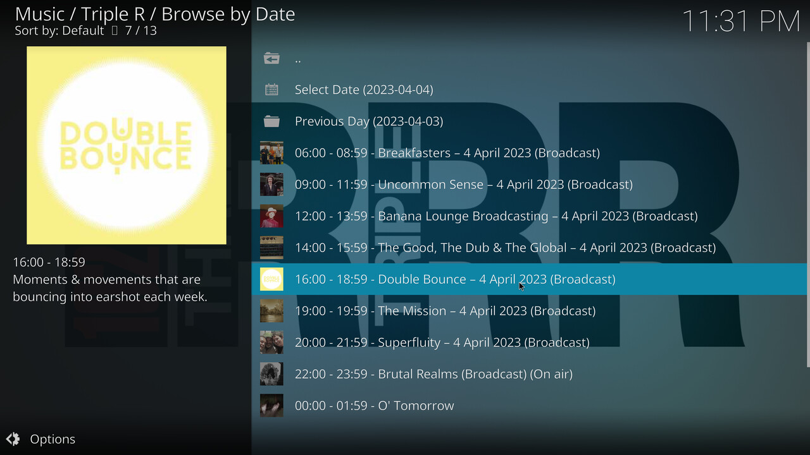
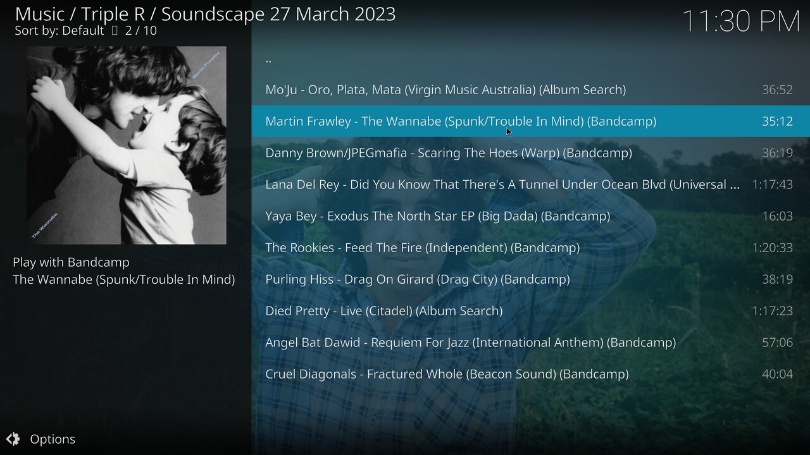

# plugin.audio.tripler

A Kodi plugin for Triple R: an independent community radio station in Melbourne, Australia.

-----

## Frequently Asked Questions

### What is Triple R?

For more than 40 years Triple R has shaped and inspired the culture of Melbourne. Since its inception as an educational broadcaster in 1976, Triple R has become Australia's most influential community radio station with nearly 21,000 paid subscribers and broadcasting live to over 1,000,000 listeners per month across FM and digital (DAB+ digital radio, podcasts and online).

Broadcasting on 102.7FM and 3RRR Digital, the Triple R grid houses over 60 diverse programs. Music shows cover every genre imaginable from pop to punk rock, from R&B and electro to jazz, hip hop, country and metal. Specialist talks programs delve into topics as varied as the environment, human rights, politics, medical issues, gardening, cultural ventures and local interests.

### What does this plugin do?

This plugin aims to provide as much content as possible from the [Triple R Website, rrr.org.au,](https://www.rrr.org.au) in the Kodi media player. Currently provided are the following:

- Listen Live!
- Browse by Program
- Browse by Date
- Latest Segments
- Audio Archives
- Album Of The Week
- Soundscapes
- Events
- Subscriber Giveaways (for logged in users only!)

-----

## Installation

If you don't already use [Kodi](https://kodi.tv/), download and install that first.

### Release Version

If you would like to use the release version with automatic updates, please install [the published release in the Kodi repository](https://kodi.tv/addons/matrix/plugin.audio.tripler/) with the following steps:

- Open Kodi.
- Navigate to Add-ons > Install from Repository.
- Navigate to Kodi Add-on repository > Music add-ons > Triple R.
- Select "Install".

### Latest Development Version

If you would instead like to use the latest development version, [download the zip file](https://github.com/molzy/plugin.audio.tripler/archive/refs/heads/scraper.zip) to the same computer that is running Kodi. Afterwareds, follow these steps:

- Open Kodi.
- From the main menu, navigate to Settings > System > Add-ons.
- Enable "Unknown Sources".
- Go back to the main menu, and navigate to Add-ons > Install from Zip File.
- If you are prompted to confirm, select "Yes" on the prompt.
- Navigate to the downloaded zip file on your filesystem.
- Select "OK".

-----

## Screenshots

### Menu

### Browse By Program

### Broadcast + Playlist

### Album Of The Week

### Browse By Date

### Soundscape

-----

## License

This plugin was initially forked from a Triple R plugin written by [Damon Toumbourou](https://github.com/DamonToumbourou/plugin.audio.tripler). 

The plugin was then fully rewritten by Simon Mollema.

The plugin is released under the terms of [the MIT license](LICENSE.txt).
