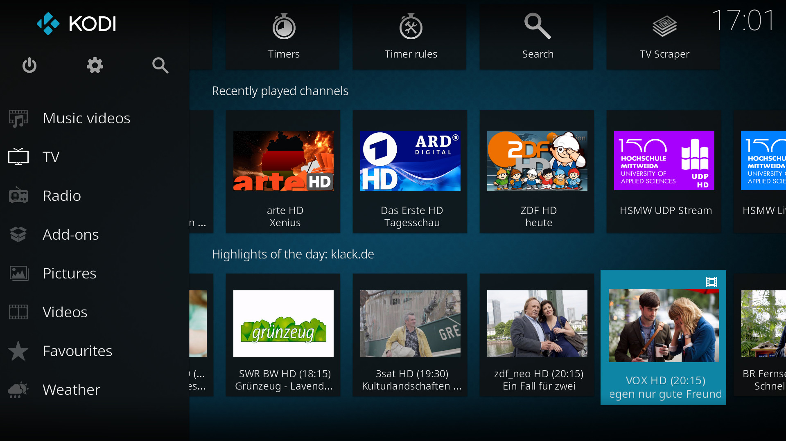

<h1>Beschreibung:</h1>

Das Plugin 'plugin.service.gto' holt von diversen RSS-Feeds die TV-Highlights des Tages und stellt diese dann als RecentlyAdded Widget im Menüpunkt TV bereit (nach Skintegration).
Hierbei kann sich das Plugin anhand der im PVR befindlichen Sender richten und zeigt optional nur TV Highlights für diese an. Desweiteren besteht eine Integration des Dienstes service.kn.switchtimer in der Sendungs-Detailansicht mit welchem die Highlights zum Umschalten vorgemerkt werden können.

The Plugin 'plugin.service.gto' fetches actual tv highlights from various RSS feeds and present them as widget in the home menu (skin integration is needed). It can show only those events optionally if they are present in the pvr channel list. Furthermore, there is an integration of the service addon 'service.kn.switchtimer' which switches to the broadcast at appropriated time.  

Das Plugin wird bei jedem Kodi Start ausgeführt und holt die Daten in Abhängigkeit vom eingestellten Intervall. Daneben erfolgt eine weitere Aktualisierung des Widgets, um z.B. abgelaufene Sendungen nach einem bestimmten Zeitpunkt aus der Anzeige zu entfernen.

The Plugin has a service which runs at Kodi start and fetches the data depending on the selected interval. In addition to update all outdated broadcasts will removed from display. 

## Skintegration:

Um die TV Highlights des Tages in Confluence zu integrieren, bitte die Hinweise in der README.txt im Ordner integration beachten! Ansonsten lässt sich das Addon auch als TV-Widget in andere Skins einbinden. Dazu benutzt das Addon eine Methode namens "Dynamic List Content". Die Integration durch den Skinner erfolgt durch den Aufruf von

To integrate the TV highlights of the day in Confluence, please follow the instructions in the README.txt in the folder integration! Otherwise, the addon can be integrated into other skins as a TV Widget too. The addon use a method called "Dynamic List Content". The integration by the skinner is done by calling:

    <content target="pvr">plugin://plugin.service.gto?action=getcontent&amp;ts=$INFO[Window(Home).Property(GTO.timestamp)]</content>

Eine genaue Beschreibung der ListItem.Labels und ListItem.Properties erfolgt weiter unten.

For detailed description see below.

## Pluginaufrufe:

Der Dienst für die Aktualisierung der Inhalte und des Widgets (starter.py) ruft das eigentliche Plugin über den Parameter 'action' auf. Dieser Parameter kann auch von anderen Plugins oder Scripten wie folgt verwendet werden:

The service for updating content and widgets (starter.py) calls the actual plugin via the parameter 'action'. This parameter can be used by other plugins or scripts as follows:

#### Führt ein erneutes Einlesen der Feeds und Webseiten durch die Scraper durch / Perform a rescan of the feeds:

    XBMC.RunScript(plugin.service.gto,action=scrape)

#### Aktualisiert das GTO Widget / Actualize the Widget:

    XBMC.RunScript(plugin.service.gto,action=refresh)

#### Öffnet eine Liste vorhandener Scraper und speichert den ausgewählten Scraper als Standardscraper / Opens a scraper list and stores the selected scraper as default:

    XBMC.RunScript(plugin.service.gto,action=change_scraper)

#### Öffnet ein Fenster mit zusätzlichen Informationen zur ausgewählten Sendung / Opens a window with additional details of the selected broadcast:

Beispiel 'onclick' für TV Highlights Element - Öffnet Popup generiert vom Plugin (script-GTO-InfoWindow.xml) / Example 'onclick' of a selected element - opens a popup window (script-GTO-InfoWindow.xml):

    <onclick>
        RunScript(plugin.service.gto,action=infopopup&blob=$INFO[ListItem.Property(BlobID))
    </onclick>

#### ListItem Labels und Properties / ListItems and Properties:

    - ListItem.Label                  Titel der Sendung (Tatort) / Broadcast title
    - ListItem.Label2                 PVR Sender (Das Erste HD) / PVR channel name
    - ListItem.Thumb                  Screenshot aus dem Titel der Sendung /screenshot of broadcast
    - ListItem.Genre                  Genre (Krimi, Komödie, Doku etc.) / genre
    - ListItem.Plot                   Beschreibung des Inhaltes der Sendung /content description of broadcast

    - ListItem.Property(DateTime)     Startdatum und Zeit, wie in Kodi Einstellungen Datum und Zeit (ohne Sek.) / Datetime of broadcast start
    - ListItem.Property(StartTime)    Startzeit (20:15) / start time
    - ListItem.Property(EndTime)      Ende der Sendung (22:00) / end time
    - ListItem.Property(RunTime)      Laufzeit in Minuten (105) / run time
    - ListItem.Property(ChannelID)    PVR Channel ID, wird zum Umschalten per json benötigt / Channel ID of PVR, needed for channel switch
    - ListItem.Property(BlobID)       ID der Datenblase zur Sendung ID / data blob ID of the broadcast

#### Info-Window (werden als Properties in Window(Home) gesetzt) / Info windows (resides as properties in Window(Home)):

    - GTO.provider                    Provider/Anbieter (scraper.shortname)
    - GTO.Info.Title                  Titel der Sendung / title
    - GTO.Info.Picture                Screenshot aus dem Titel der Sendung / screenshot
    - GTO.Info.Description            Beschreibung des Inhaltes / description
    - GTO.Info.Genre
    - GTO.Info.Channel                PVR Kanalname / PVR channel name
    - GTO.Info.Logo                   PVR Kanallogo / PVR channel logo
    - GTO.Info.PVRID                  PVR Channel ID / PVR channel id
    - GTO.Info.Date                   Datum und Uhrzeit 'dd.mm.yy hh:mm', wird benötigt für Switchtimer / datetime in format 'dd.mm.yy hh:mm'
    - GTO.Info.StartTime              Startzeit (hh:mm) / start time
    - GTO.Info.EndTime                Endzeit (hh:mm) / end time
    - GTO.Info.Cast                   Darsteller / cast

#### Debugging:

Das Plugin wird gesprächig, wenn in den Einstellungen von Kodi unter System, Logging das Debug-Logging aktiviert wird.

The Plugin tells much more if You activate the debug mode within Kodi.

----------------------------------------------------------------------------------------------------------------------

[more screenshots](resources/lib/media/screenshots)

