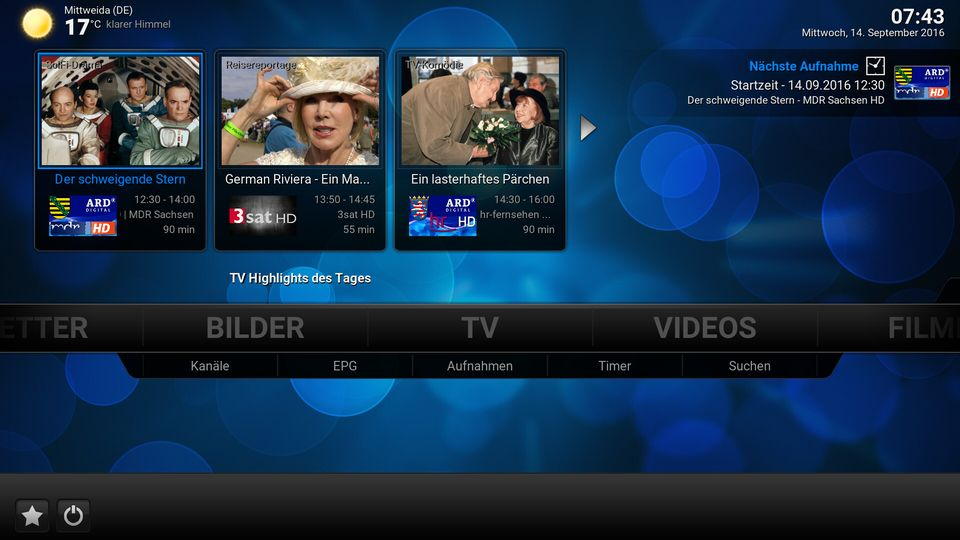

Beschreibung:
=============

Das Plugin 'plugin.service.gto' holt von diversen RSS-Feeds die TV-Highlights des Tages und stellt diese dann als RecentlyAdded Widget im Menüpunkt TV bereit (nach Skintegration).
Hierbei kann sich das Plugin anhand der im PVR befindlichen Sender richten und zeigt optional nur TV Highlights für diese an. Desweiteren besteht eine Integration des Dienstes service.kn.switchtimer in der Sendungs-Detailansicht mit welchem die Highlights zum Umschalten vorgemerkt werden können.

Das Plugin wird bei jedem Kodi Start ausgeführt und holt die Daten in Abhängigkeit vom eingestellten Intervall. Daneben erfolgt eine weitere Aktualisierung des Widgets, um z.B. abgelaufene Sendungen nach einem bestimmten Zeitpunkt aus der Anzeige zu entfernen.

Skintegration:

Um die TV Highlights des Tages in Confluence zu integrieren, bitte die Hinweise in der README.txt im Ordner integration beachten! Ansonsten lässt sich das Addon auch als TV-Widget in andere Skins einbinden. Dazu benutzt das Addon eine Methode namens "Dynamic List Content". Die Integration durch den Skinner erfolgt durch den Aufruf von

    <content target="pvr">plugin://plugin.service.gto?action=getcontent&amp;ts=$INFO[Window(Home).Property(GTO.timestamp)]</content>

Eine genaue Beschreibung der ListItem.Labels und ListItem.Properties erfolgt weiter unten.

Pluginaufrufe:

Der Dienst für die Aktualisierung der Inhalte und des Widgets (starter.py) ruft das eigentliche Plugin über den Parameter 'action' auf. Dieser Parameter kann auch von anderen Plugins oder Scripten wie folgt verwendet werden:

Führt ein erneutes Einlesen der Feeds und Webseiten durch die Scraper durch:

    XBMC.RunScript(plugin.service.gto,action=scrape)

Aktualisiert das GTO Widget:

    XBMC.RunScript(plugin.service.gto,action=refresh)

Öffnet eine Liste vorhandener Scraper und speichert den ausgewählten Scraper als Standardscraper:

    XBMC.RunScript(plugin.service.gto,action=change_scraper)

Öffnet ein Fenster mit zusätzlichen Informationen zur ausgewählten Sendung:

Beispiel 'onclick' für TV Highlights Element - Öffnet Popup generiert vom Plugin (script-GTO-InfoWindow.xml):

    <onclick>
        RunScript(plugin.service.gto,action=infopopup&blob=$INFO[ListItem.Property(BlobID))
    </onclick>

ListItem Labels und Properties:

    - ListItem.Label                  Titel der Sendung (Tatort)
    - ListItem.Label2                 PVR Sender (Das Erste HD)
    - ListItem.Thumb                  Screenshot aus dem Titel der Sendung
    - ListItem.Genre                  Genre (Krimi, Komödie, Doku etc.)
    - ListItem.Plot                   Beschreibung des Inhaltes der Sendung

    - ListItem.Property(DateTime)     Startdatum und Zeit, wie in Kodi Einstellungen Datum und Zeit (ohne Sek.)
    - ListItem.Property(StartTime)    Startzeit (20:15)
    - ListItem.Property(EndTime)      Ende der Sendung (22:00)
    - ListItem.Property(RunTime)      Laufzeit in Minuten (105)
    - ListItem.Property(ChannelID)    PVR Channel ID, wird zum Umschalten per json benötigt.
    - ListItem.Property(BlobID)       ID der Datenblase zur Sendung

Info-Window (werden als Properties in Window(Home) gesetzt):

    - GTO.Info.Title                  Titel der Sendung
    - GTO.Info.Picture                Screenshot aus dem Titel der Sendung
    - GTO.Info.Description            Beschreibung des Inhaltes
    - GTO.Info.Genre
    - GTO.Info.Channel                PVR Kanalname
    - GTO.Info.Logo                   PVR Kanallogo
    - GTO.Info.PVRID                  PVR Channel ID
    - GTO.Info.Date                   Datum und Uhrzeit 'dd.mm.yy hh:mm', wird benötigt für Switchtimer
    - GTO.Info.StartTime              Startzeit (hh:mm)
    - GTO.Info.EndTime                Endzeit (hh:mm)

Debugging:

Das Plugin wird gesprächig, wenn in den Einstellungen von Kodi unter System, Logging das Debug-Logging aktiviert wird.

----------------------------------------------------------------------------------------------------------------------

