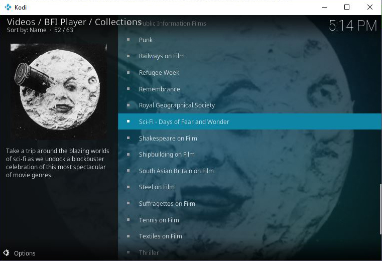
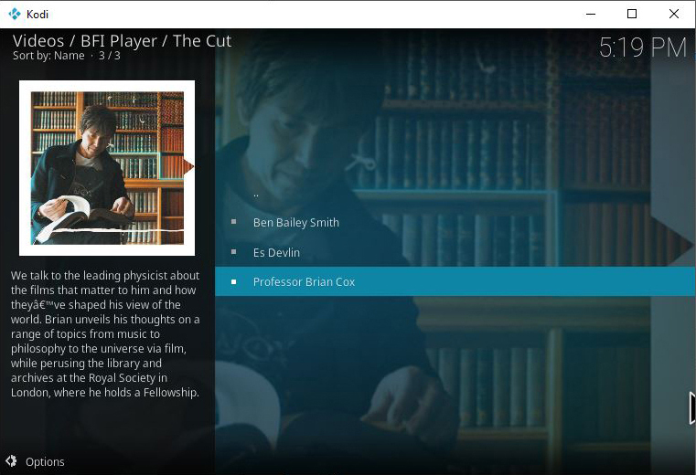
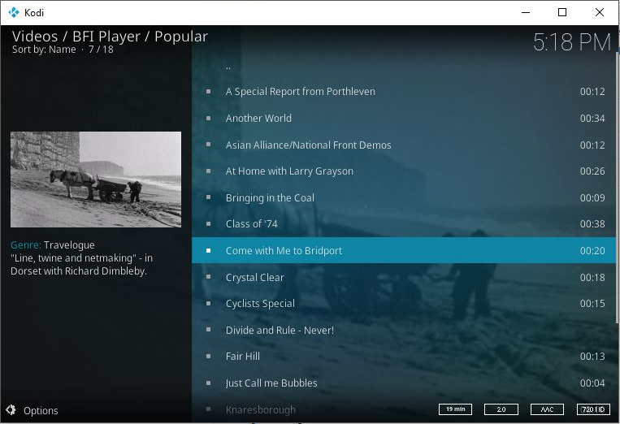
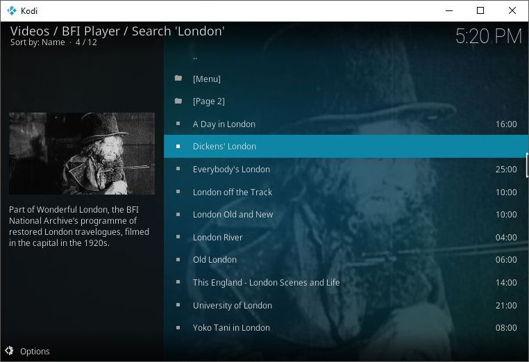
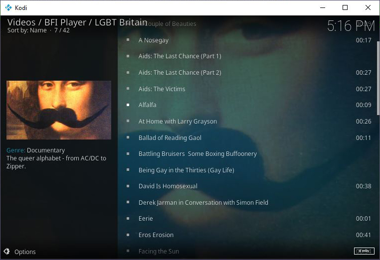
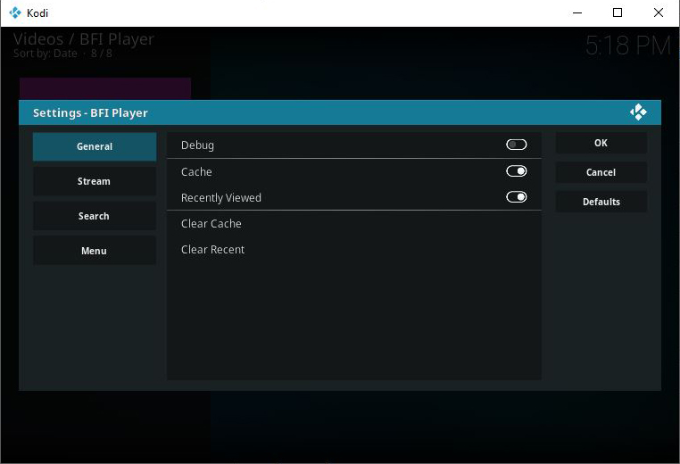

# plugin.video.bfi

This add-on enables playing of videos and movies from the [BFI Player](https://player.bfi.org.uk) website.

*   Shows generic collections "new" and "popular"
*   Shows collections such as; Thriller, Family Films, Unavailable on DVD and Public Information Films
*   Allows searching the archive and saved searches
*   Caches recently viewed files for fast replay 

## About BFI Player

Founded in 1933, the British Film Institute (BFI) is a registered charity governed by Royal Charter.
The BFI Player allows users to view shorts and features, showing the best from the BFI, national and regional archives - including 120 years of Britain on film

## Disclaimer 

This add-on is not created, maintained or in any way affiliated with the British Film Institute.
It only provides an interface to access the free content on the BFI Player website from Kodi.

## Screen Shots

## Licence 

All art work, code and data is provided under an [MIT License](https://github.com/FraserChapman/plugin.video.bfi/blob/master/LICENSE.txt)

Except the two images icon.png and fanart.jpg

[Twitter - Public Domain / Fair use](https://twitter.com/bfiplayer)

[Maria Giulia Tolotti - Creative Commons Attribution-Share Alike 3.0 Unported](https://commons.wikimedia.org/wiki/File:BFI_Southbank0182.JPG)

