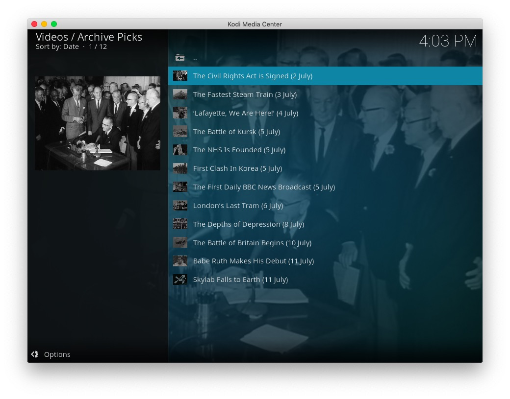
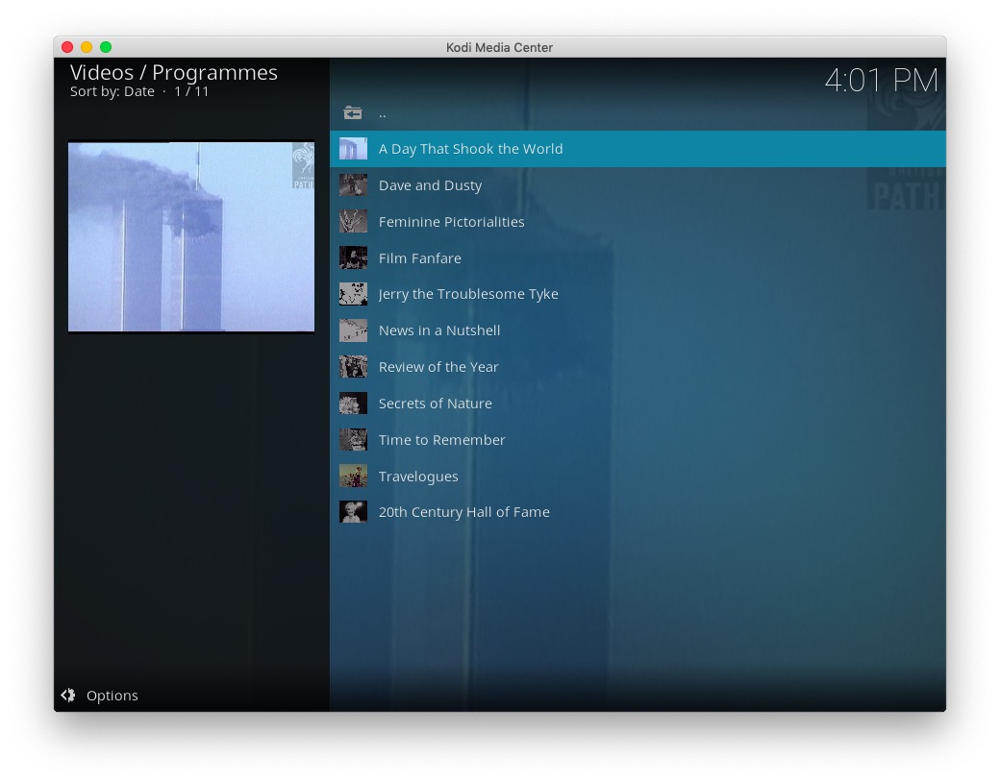
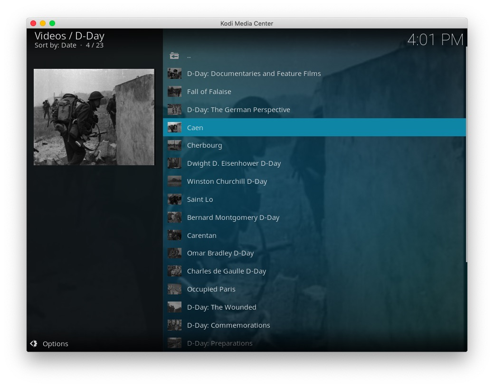
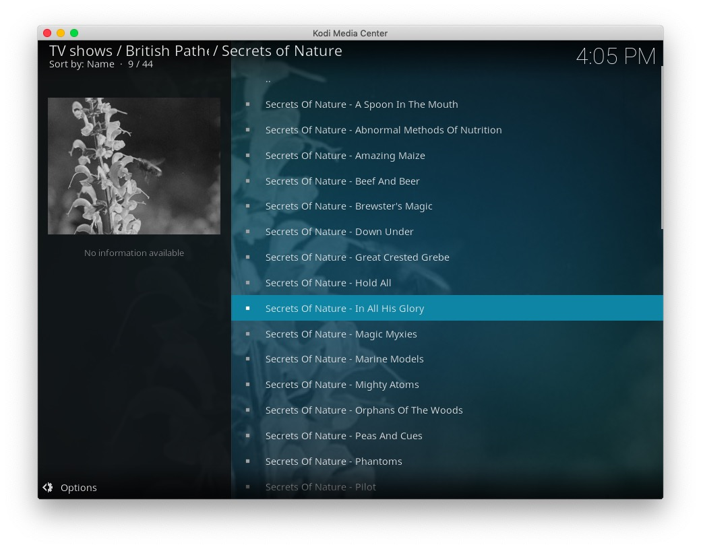
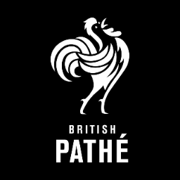

# plugin.video.bp

This add-on enables playing of videos and movies from the [British Pathé](https://www.britishpathe.com/) website.

*   Shows collections such as; War Collections, Politics & Political Figures, Country Profiles, etc
*   Show full programme series such as; A Day That Shook the World, Review of the Year, Secrets of Nature, etc
*   Allows searching the archive and saved searches
*   Caches recently viewed files for fast replay 

## The Collection

British Pathé is considered to be the finest newsreel archive in the world and is a treasure trove of 85,000 films unrivalled in their historical and cultural significance.
British Pathé also represents the Reuters historical collection, which includes more than 120,000 items from Reuters-owned news agencies.

## Disclaimer 

This add-on is not created, maintained or in any way affiliated with British Pathé or Reuters.
It only provides an interface to access the free content on the British Pathé website from Kodi.

## Screen Shots

## Licence 

All art work, code and data is provided under an [MIT License](LICENSE.txt)

Except the two images icon.png and fanart.jpg

[Twitter - Public Domain / Fair use](https://twitter.com/BritishPathe)

[Vimeo - Public Domain / Fair Use](https://vimeo.com/britishpathe)
