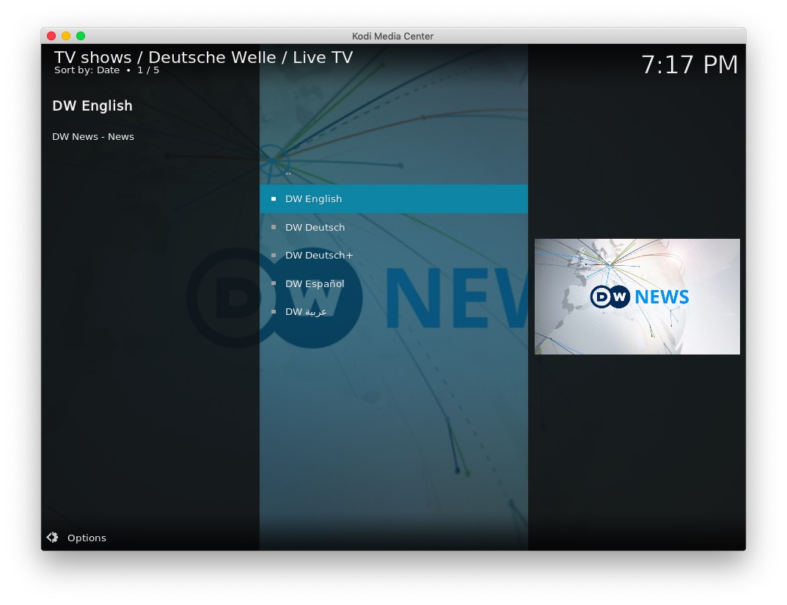
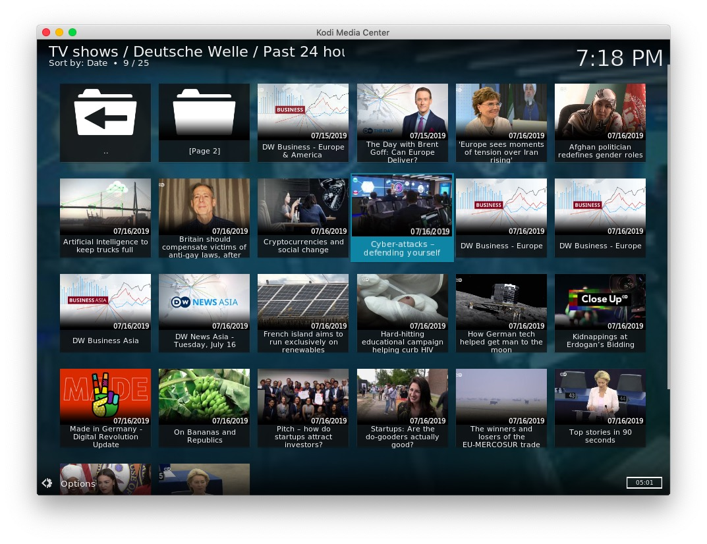
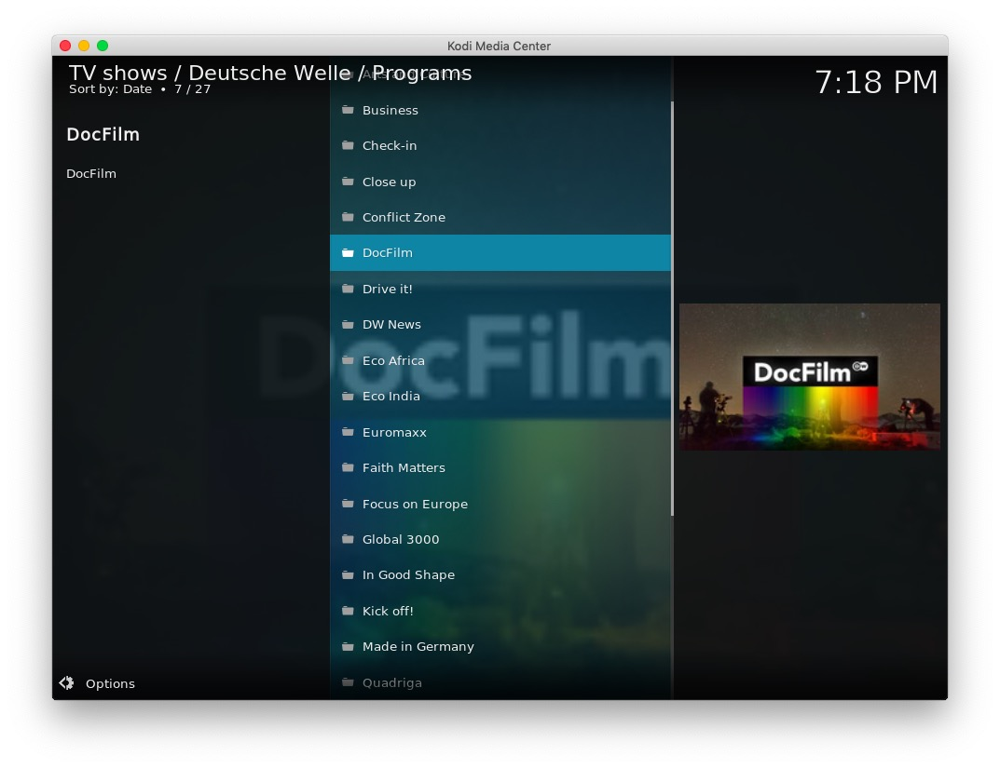
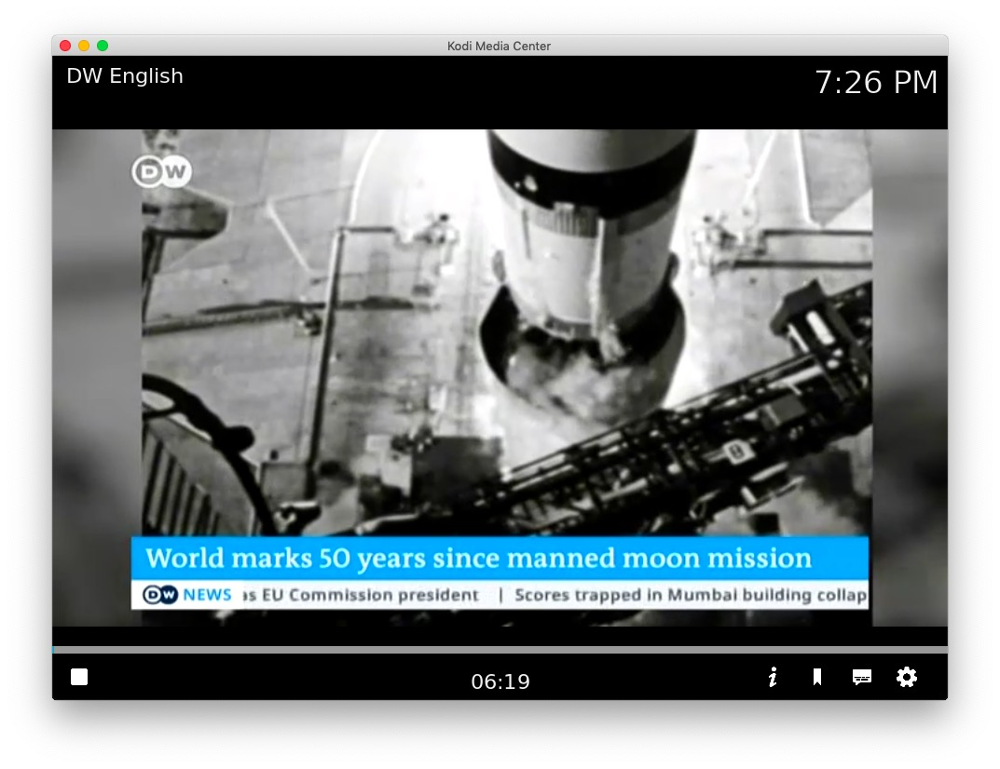
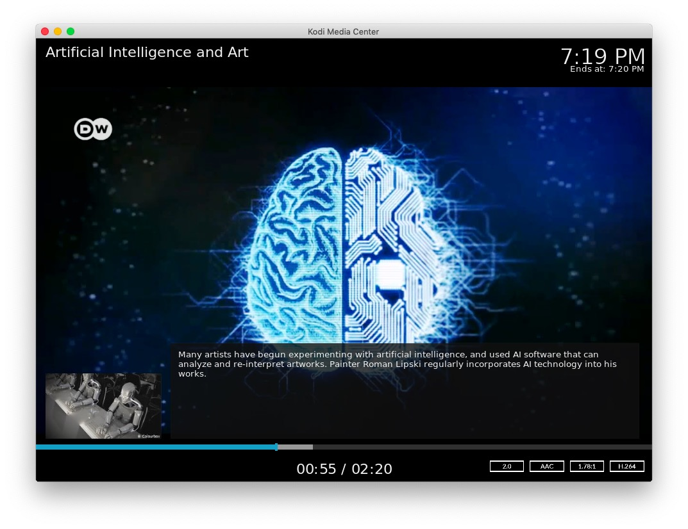

# plugin.video.dw

This add-on enables playing of videos and movies from the [Deutsche Welle](https://www.dw.com/) website.

*   Shows Live TV such as; DW English, DW Deutsch, DW Deutsch+, DW Español and عربية DW 
*   Shows TV Programmes such as; Arts.21, Close Up, DocFilm, etc
*   Shows topics such as; Lifestyle, Education, Science, Sports, etc
*   Shows programs from the last 24 hours
*   Allows searching and saved searches
*   Caches recently viewed files for fast replay 

## Notes on language

To view Arabic characters with the default Estuary skin you need to set the font to "Arial based"

```Settings -> Interface -> Fonts "Arial based"```

The language option in the add-on settings applies to "Search" results and items in "Last 24 hours" section - "Topic" and "Programme" text is always in English (en). 
 
## The Collection

Deutsche Welle is Germany’s international broadcaster. It conveys a comprehensive image of Germany, reports events and developments and incorporates German and other perspectives in a journalistically independent manner.

## Disclaimer 

This add-on is not created, maintained or in any way affiliated with Deutsche Welle. It only provides an interface to access the free content on the Deutsche Welle website from Kodi.

## Screen Shots







## Licence 

All art work, code and data is provided under an [MIT License](LICENSE.txt)

Except the two images icon.png and fanart.jpg


[Twitter - Public Domain / Fair use](https://twitter.com/DeutscheWelle)


[Daily Motion - Public Domain / Fair Use](https://www.dailymotion.com/video/x3rb768)

[](https://www.codacy.com/app/FraserChapman/plugin.video.dw?utm_source=github.com&amp;utm_medium=referral&amp;utm_content=FraserChapman/plugin.video.dw&amp;utm_campaign=Badge_Grade)
