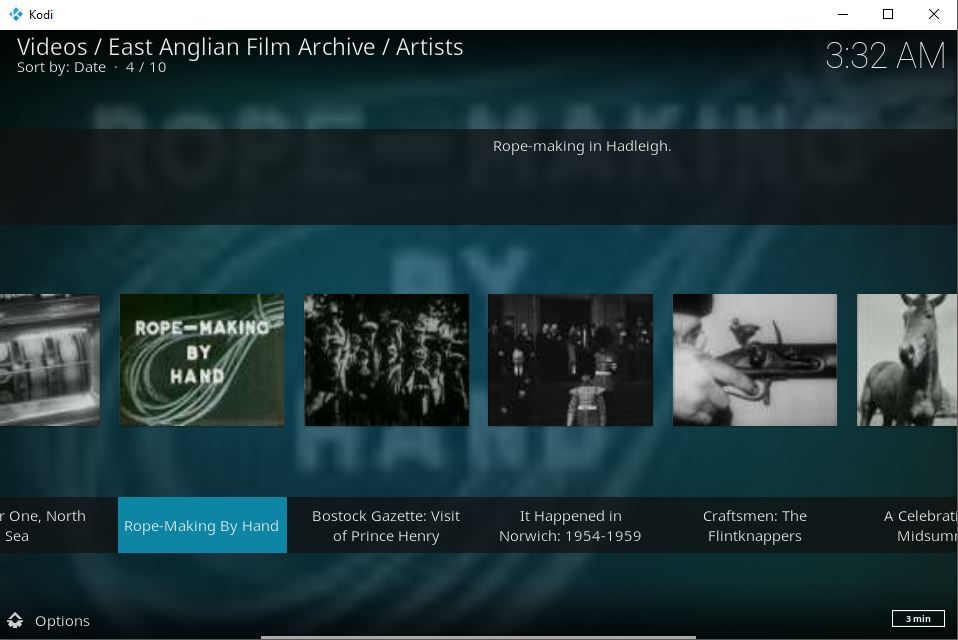
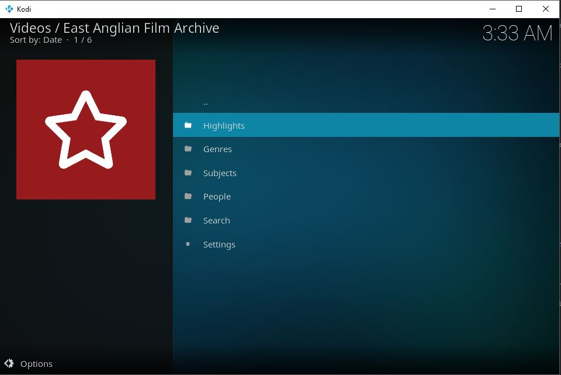
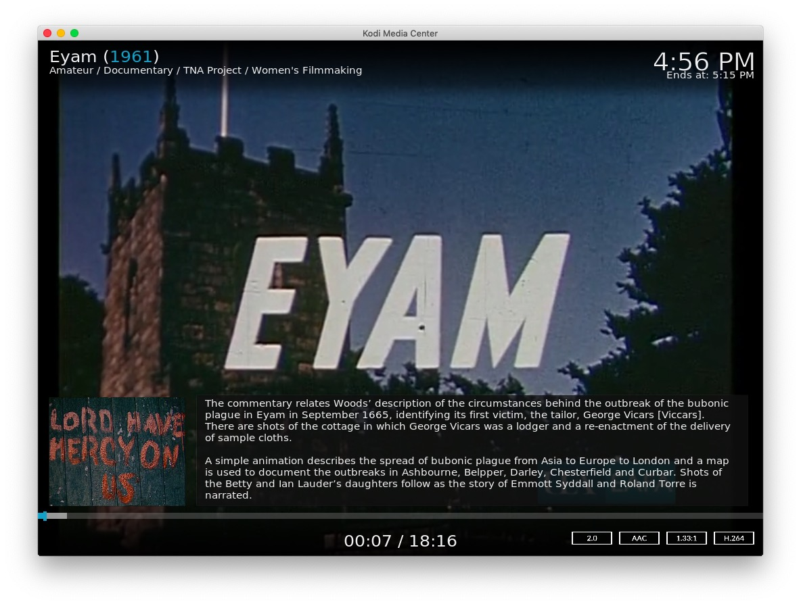

# plugin.video.eafa

This add-on enables playing of videos and movies from the [East Anglian Film Archive](http://www.eafa.org.uk/) website.

*   Allows browsing main sections; Highlights, Genres, People, etc
*   Allow searching and saved searches
*   Caches recently viewed items for fast replay

[Donations for this add-on gratefully accepted](https://www.paypal.me/fraserchapman)

## About East Anglian Film Archive 

> The East Anglian Film Archive, the first Regional Film Archive in England, was established in 1976 as an educational resource for the future by its visionary first Director, David Cleveland, who ran it until his retirement in 2004.
> 
> Since 1984 the Archive has been owned and operated by the University of East Anglia, Norwich (UEA), as a not for profit research and public access resource.

This add-on provides access to over 200 hours of film, spanning 1,200 individual titles. Many of national and international significance.

[About the archive](http://www.eafa.org.uk/about-the-archive.aspx)

## Disclaimer 

This add-on is not created, maintained or in any way affiliated with the East Anglian Film Archive.

It only provides an interface to access the free content on the East Anglian Film Archive website from Kodi.

## Screen Shots

## Licence 

All art work, code and data is provided under an [MIT License](https://github.com/FraserChapman/plugin.video.eafa/blob/master/LICENSE.txt)

Except the image icon.png

[EAFA - Public Domain / Fair use](http://www.eafa.org.uk/)

Fan-art by Fraser

