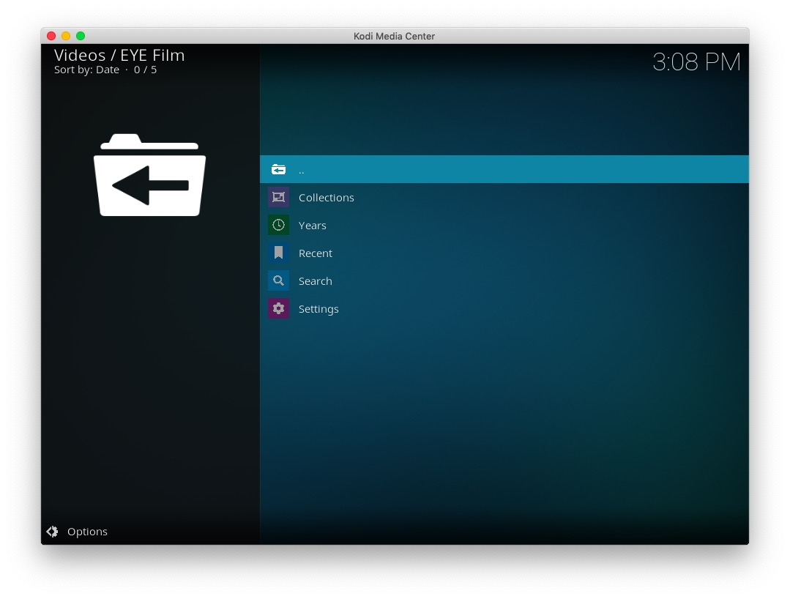
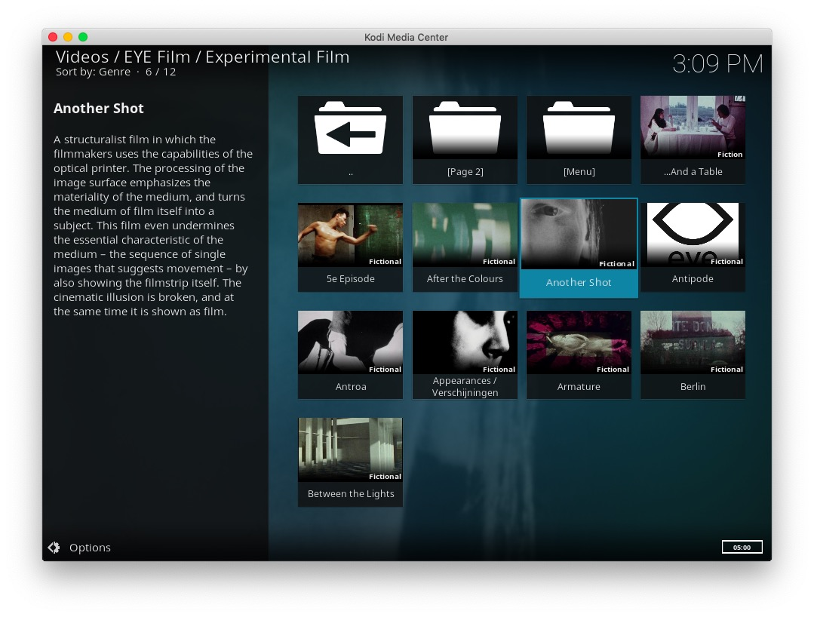
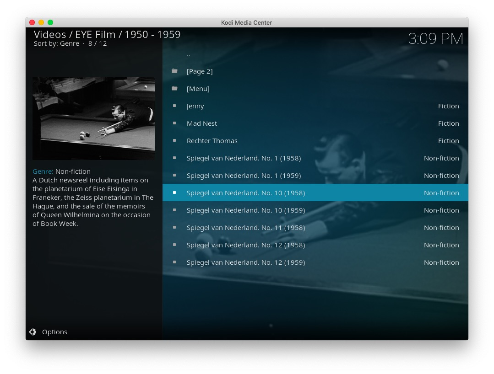

# plugin.video.eye

This add-on enables playing of videos and movies from the [EYE Film Institute Netherlands](https://www.eyefilm.nl/) website.

* Shows main categories such as silent film, news-reels and experimental film
* Allows searching the archive and saved searches
* Caches recently viewed files for fast replay 
* Uses [a nice little Cache](https://github.com/FraserChapman/cache) to remain fast and responsive

# The Collection

EYE Film Institute Netherlands manages more than 40,000 films from all genres: a fine sample of film history, from classics and blockbusters to cult films.
EYE is renowned worldwide for its knowledge and expertise in the field of film restoration and research.

# Disclaimer 

This add-on is not created, maintained or in any way affiliated with the EYE Film Institute Netherlands. It only provides an interface to access the free content on the EYE Film Institute Netherlands website from Kodi.

# Screen Shots

# Licence 

All art work, code and data is provided under an [MIT License](https://github.com/FraserChapman/plugin.video.eye/blob/master/LICENSE.txt)

Except the two images icon.png and fanart.jpg

[Twitter - Public Domain / Fair use](https://twitter.com/eye_film)

[Vimeo - Fair Use](https://i.vimeocdn.com/video/574953203.jpg?mw=1920&mh=1080&q=70)

