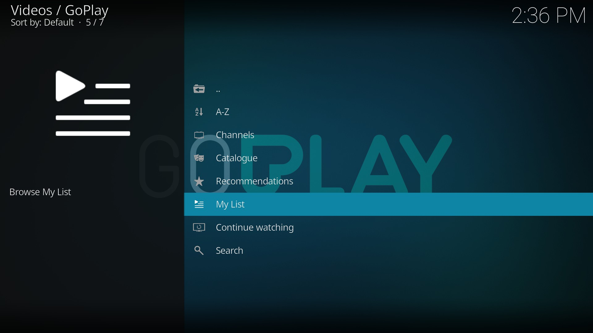
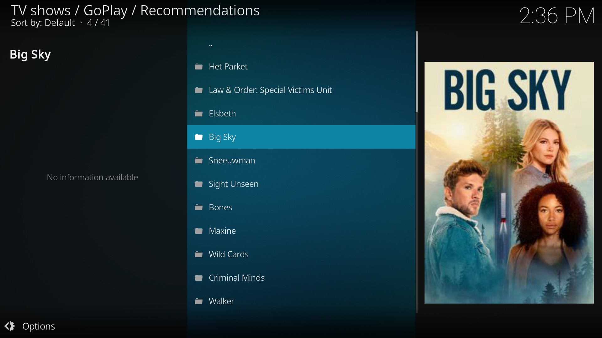
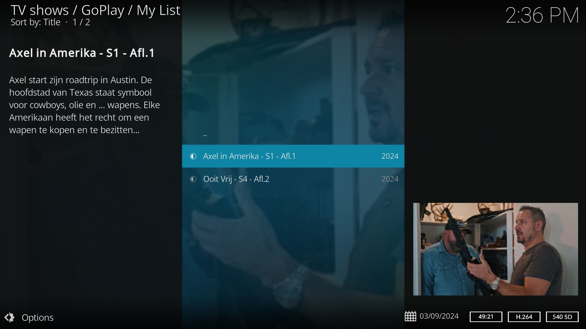

# GoPlay Kodi add-on

*plugin.video.goplay* is een Kodi add-on om de video-on-demand content van [GoPlay](https://www.goplay.be/) te bekijken. Hiervoor dien je eerst een
account op [goplay.be](https://www.goplay.be/) aan te maken.

## Features

De volgende features worden ondersteund:
* Bekijk on-demand content van Play4, Play5, Play6, Play7 en Play Crime
* Doorzoeken van alle programma's

## Screenshots

<table>
  <tr>
    <td></td>
    <td></td>
    <td></td>
  </tr>
 </table>

## Changelog

## [v0.5.1](https://github.com/add-ons/plugin.video.goplay/tree/v0.5.1) (2024-10-21)

- Fix caching (@mediaminister)
- Add support for external Widevine device (@mediaminister)

## [v0.5.0](https://github.com/add-ons/plugin.video.goplay/tree/v0.5.0) (2024-09-11)

- Update to new GoPlay API (@mediaminister)
