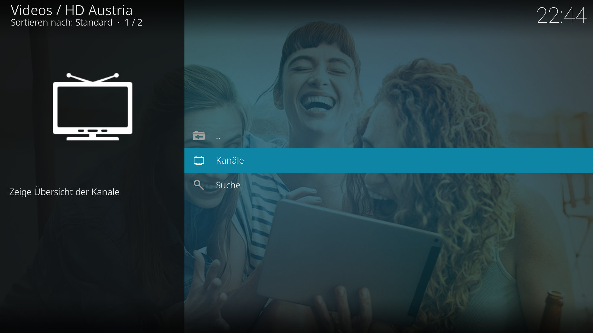
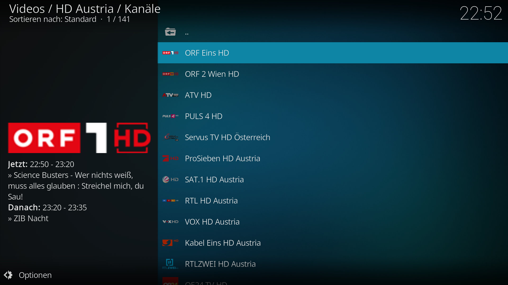
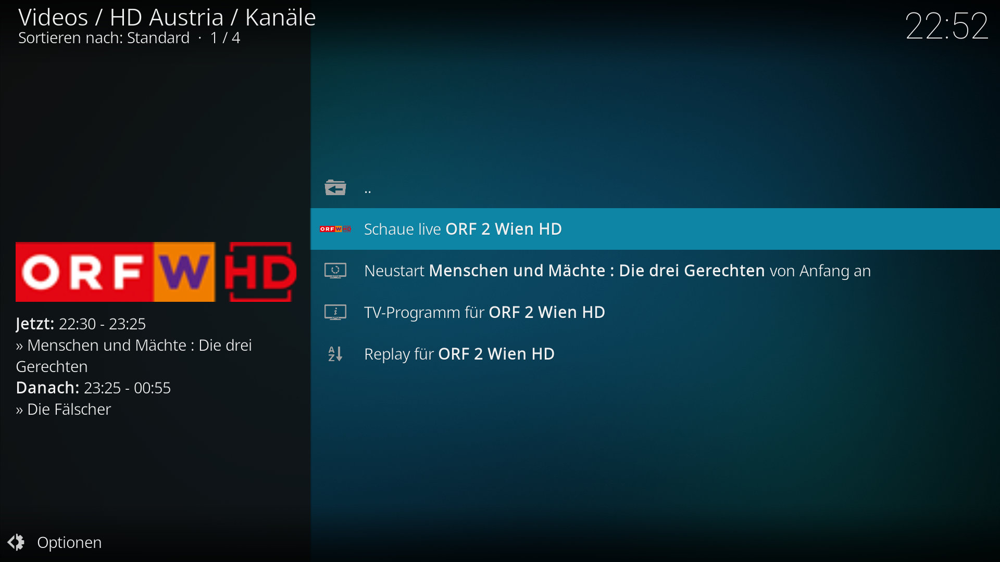

# HD Austria Kodi Add-on

*plugin.video.hdaustria* ist ein Kodi add-on für Live TV, Restart TV und Replay TV mit deinem HD Austria Abonnement.

> Note: Du brauchst ein kostenpflichtiges Abonnement von [HD Austria](https://www.hdaustria.at/).

## Installation

Du kannst die letzte Version dieses add-ons unter [releases](https://github.com/add-ons/plugin.video.tvvlaanderen/releases) aus diesem repository herunterladen.

## Features

Die folgenden Features werden unterstützt:

* Live TV
* Restart TV, aktuelle Sendung von Anfang an ansehen (nicht bei allen Sendungen)
* Replay TV, Sendungen der letzten 7 Tage ansehen (nicht bei allen Sendungen)
* Durchsuchen des Programms
* Integrations des [IPTV Manager](https://github.com/add-ons/service.iptv.manager)

## Screenshots

<table>
  <tr>
    <td></td>
    <td></td>
    <td></td>
  </tr>
 </table>

## Disclaimer

Dieses add-on wird nicht von der M7 Group herausgegeben oder supportet, sondern wird angeboten 'as is' ohne jede Garantie.
