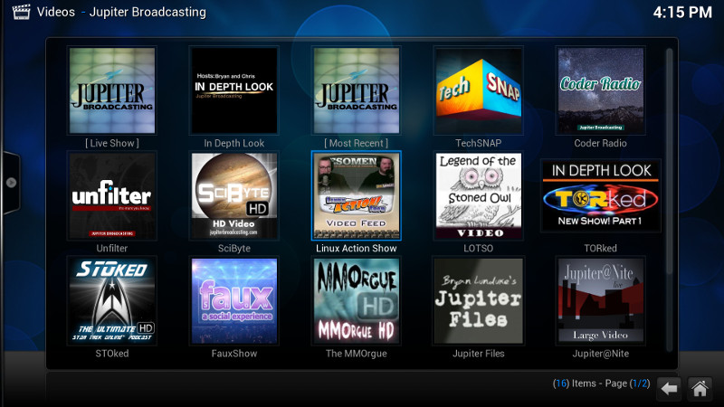

# Jupiter Broadcasting Kodi Addon

[](https://travis-ci.org/JupiterBroadcasting/plugin.video.jupiterbroadcasting)

Watch shows from the [Jupiter Broadcasting](http://jupiterbroadcasting.com) network in [Kodi](http://kodi.tv).



## Shows

* [JBLive.TV](http://jblive.tv)
* [Ask Noah](http://www.jupiterbroadcasting.com/show/asknoah/)
* [BSD Now](http://www.jupiterbroadcasting.com/show/bsdnow/)
* [Coder Radio](http://www.jupiterbroadcasting.com/show/coderradio/)
* [Linux Action News](http://linuxactionnews.com)
* [Linux Unplugged](http://www.jupiterbroadcasting.com/show/linuxun/)
* [TechSNAP](http://www.jupiterbroadcasting.com/show/techsnap/)
* [Unfilter](http://www.jupiterbroadcasting.com/show/unfilter/)
* [User Error](http://www.jupiterbroadcasting.com/show/error/)

## Archive

* [Beer Is Tasty](http://www.jupiterbroadcasting.com/show/beeristasty/)
* [FauxShow](http://www.jupiterbroadcasting.com/show/fauxshow/)
* [HowTo Linux](http://www.jupiterbroadcasting.com/show/h2l/)
* [In Depth Look](http://www.jupiterbroadcasting.com/show/indepthlook/)
* [Jupiter Files](http://www.jupiterbroadcasting.com/?s=%22jupiter+files%22)
* [Jupiter@Nite](http://www.jupiterbroadcasting.com/show/nite/)
* [Linux Action Show](http://www.jupiterbroadcasting.com/show/linuxactionshow/)
* [LOTSO](http://www.jupiterbroadcasting.com/show/legend-of-the-stoned-owl/)
* [MMOrgue](http://www.jupiterbroadcasting.com/show/mmorgue/)
* [Plan B](http://www.jupiterbroadcasting.com/show/planb/)
* [SciByte](http://www.jupiterbroadcasting.com/show/scibyte/)
* [STOked](http://www.jupiterbroadcasting.com/show/stoked/)
* [Tech Talk Today](http://www.jupiterbroadcasting.com/show/today/)
* [TORked](http://www.jupiterbroadcasting.com/show/torked/)
* [Women's Tech Radio](http://www.jupiterbroadcasting.com/show/wtr/)

## Install

1. Visit Video Addons
2. Select Get More...
3. Find and select the Jupiter Broadcasting addon


## Development

### Environment
* Requires make, python pip, and virtualenv
```bash
$ sudo apt-get install python-pip
$ pip install virtualenv
```
* Clone plugin into Kodi Addons folder, this is sufficient for use/testing
```bash
$ cd ~/.kodi/addons/
$ git clone git@github.com:JupiterBroadcasting/plugin.video.jupiterbroadcasting.git
```
* Setup development environment
```bash
$ make venv
$ source venv/bin/activate
```
* Run unit tests
```bash
$ make tests
```
* Exit virtual env
```bash
$ deactivate
```


### Tools

* [Google Python Style Guide](https://google.github.io/styleguide/pyguide.html) for consistent styles
* [Pylint](http://pylint.org)


## About

* Author: [Rob Loach](http://robloach.net)
* Source: [GitHub](https://github.com/JupiterBroadcasting/plugin.video.jupiterbroadcasting)
