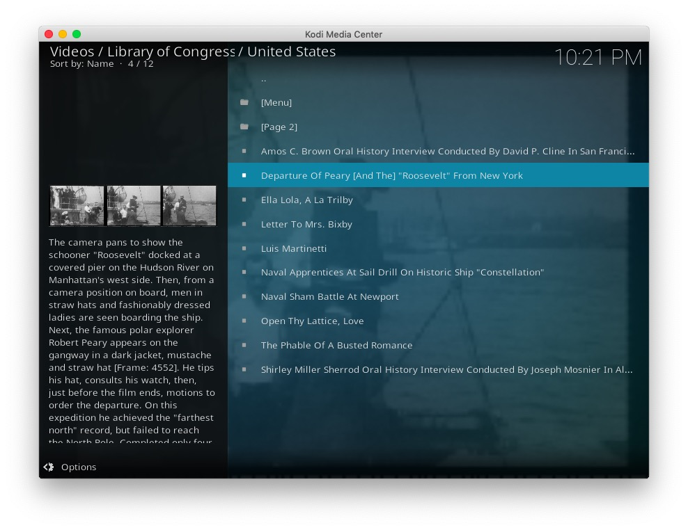
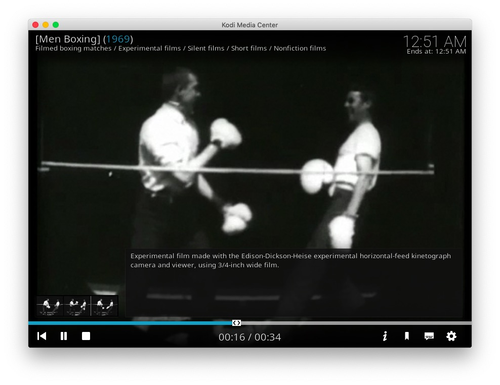
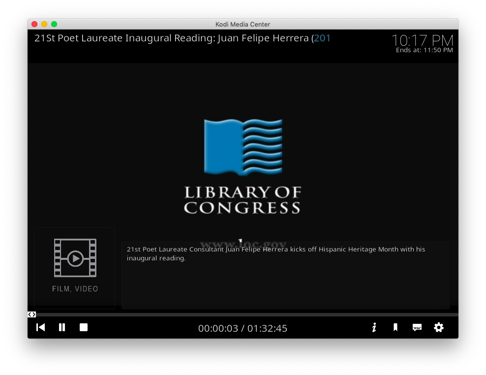
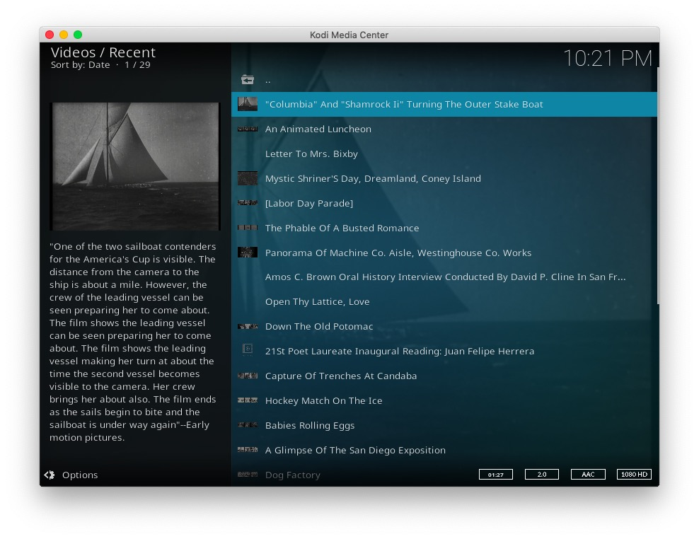
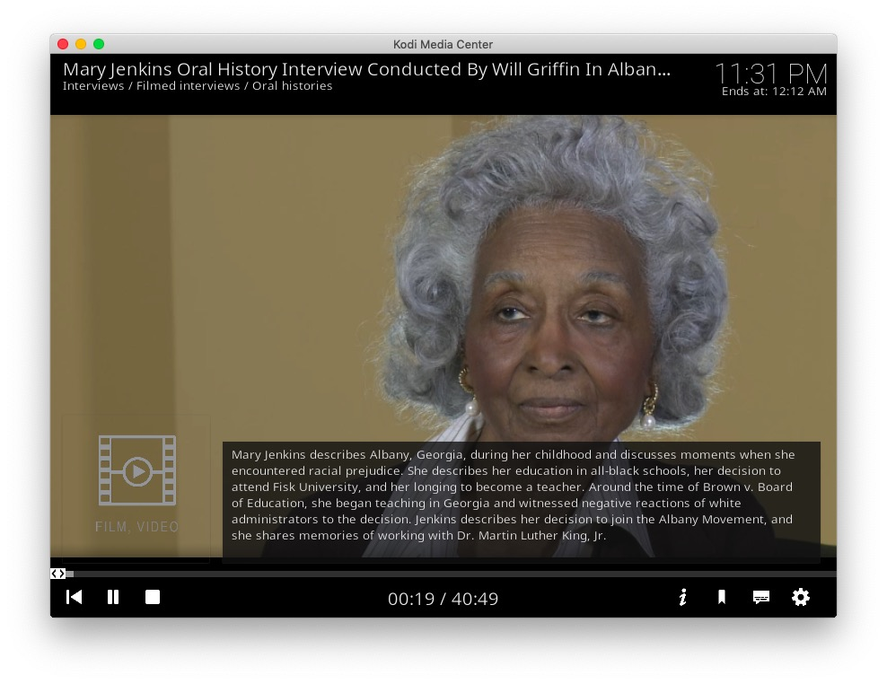

# plugin.video.loc

This add-on enables playing of videos and movies from the [Library of Congress](https://www.loc.gov/) website.

*   Shows collections such as; National Book Festivals, American Folklife Center, Event Videos, etc
*   Shows collections by; Contributor, Subject, Location, etc
*   Allows searching the archive and saved searches
*   Caches recently viewed files for fast replay 

[Donations for this add-on gratefully accepted](https://www.paypal.me/fraserchapman)

## The Collection

The Library of Congress is the largest library in the world, with millions of books, recordings, photographs, newspapers, maps and manuscripts in its collections.
The Library is the main research arm of the U.S. Congress and the home of the U.S. Copyright Office.
Several thousand clips, videos and early motion pictures are viewable from the Library's Digital Collection.

## Disclaimer 

This add-on is not created, maintained or in any way affiliated with the Library of Congress.
It only provides an interface to access the free content on the Library of Congress website from Kodi.

## Screen Shots

## Licence 

All art work, code and data is provided under an [MIT License](LICENSE.txt)

Except the two images icon.png and fanart.jpg

[Library of Congress - Fair use](https://www.loc.gov/)

[10wallpaper - Fair Use](https://www.10wallpaper.com/view/Washington_Library_of_Congress-2017_Bing_Desktop_Wallpapers.html)

