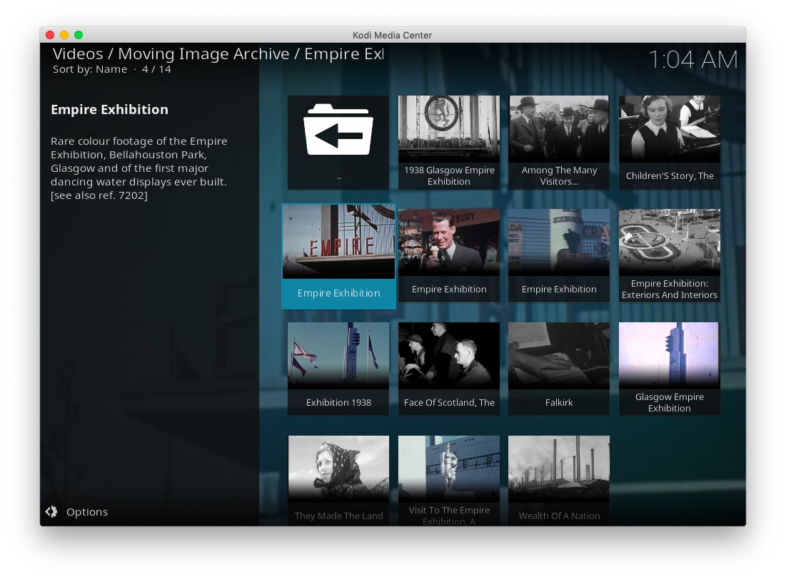
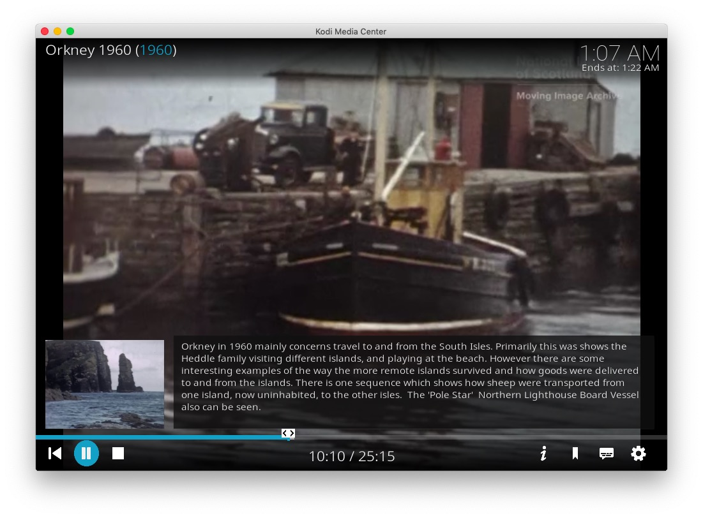
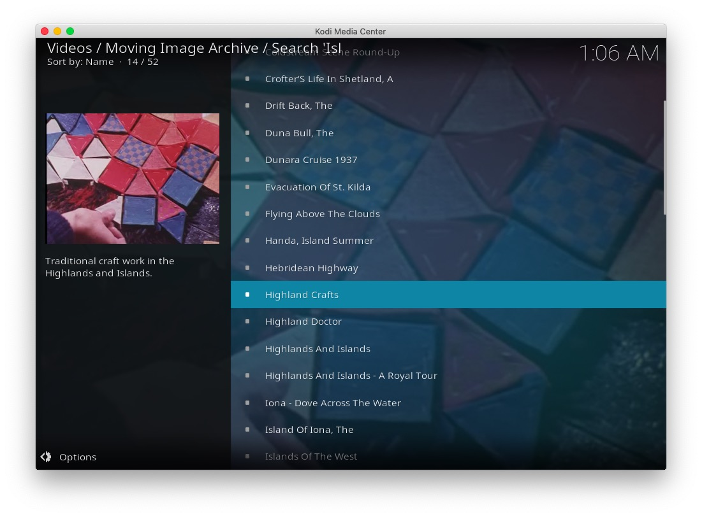
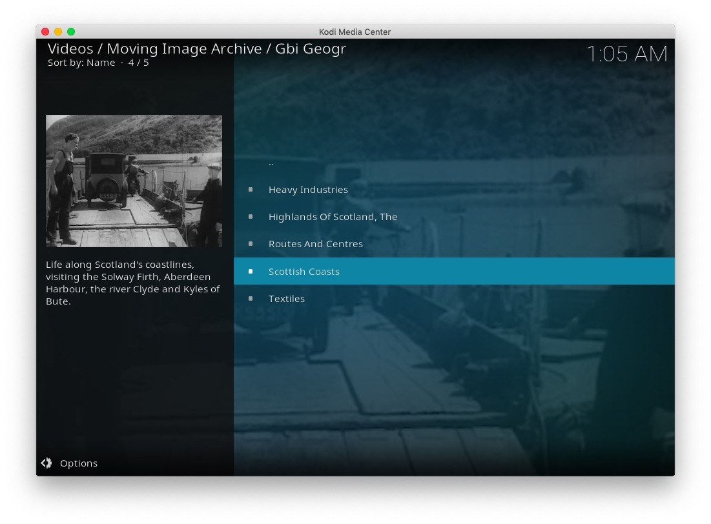
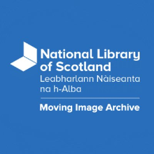
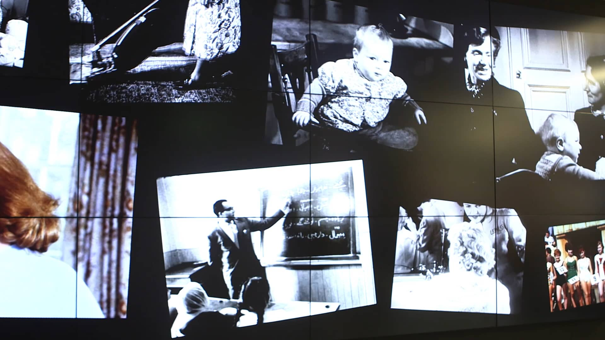

# plugin.video.mia

This add-on enables playing of videos and movies from the [National Library of Scotland Moving Image Archive](https://movingimage.nls.uk/) website.

*   Shows collections such as; Series, Featured films, Latest videos, etc
*   Shows collections by; place, genre, subject, etc
*   Allows searching the archive and saved searches
*   Caches recently viewed files for fast replay 

## The Collection

The Moving Image Archive is Scotland's national collection of moving image and is held at the National Library. You can watch over 2,000 clips and full-length films from the collection on the Moving Image Archive catalogue.

## Disclaimer 

This add-on is not created, maintained or in any way affiliated with the National Library of Scotland Moving Image Archive.
It only provides an interface to access the free content on the National Library of Scotland Moving Image Archive website from Kodi.

## Screen Shots

## Licence 

All art work, code and data is provided under an [MIT License](LICENSE.txt)

Except the two images icon.png and fanart.jpg

[Twitter - Public Domain / Fair use](https://twitter.com/scotsonscreen)

[Vimeo - Public Domain / Fair Use](https://vimeo.com/196411728)
