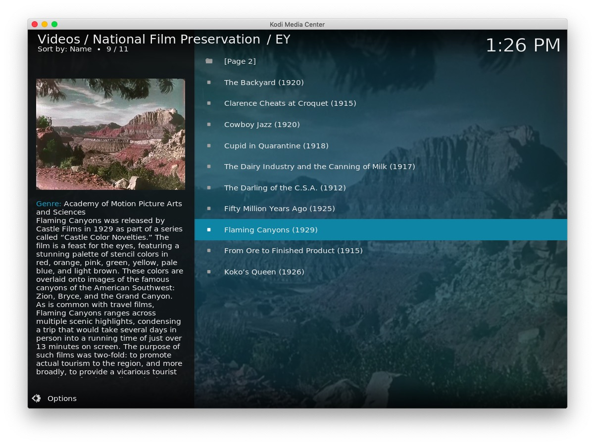
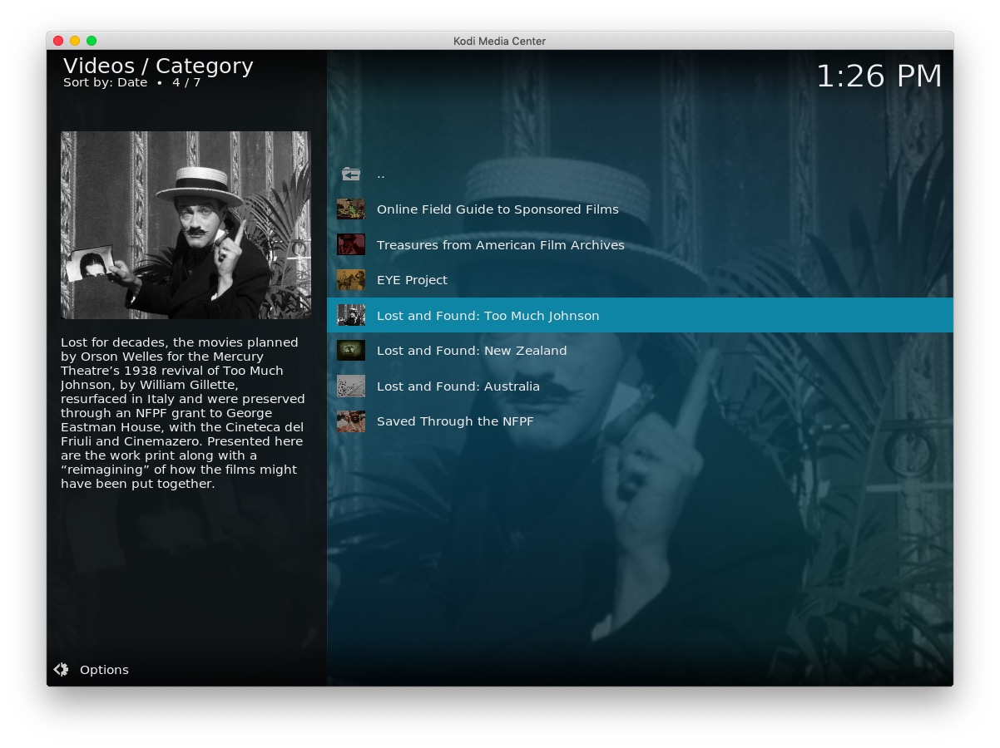
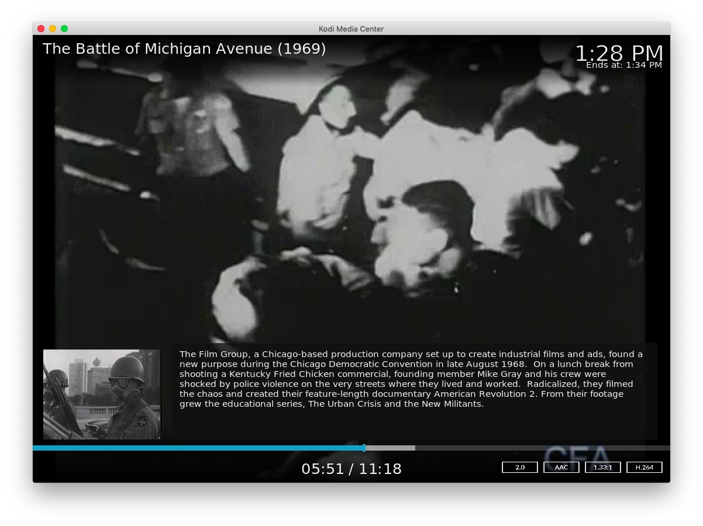
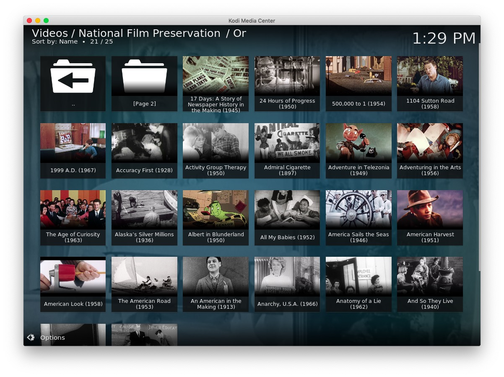
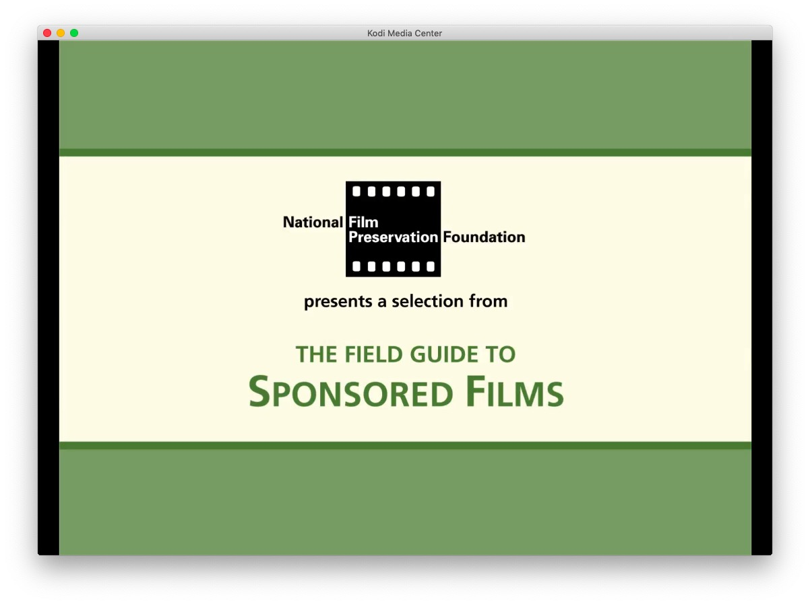
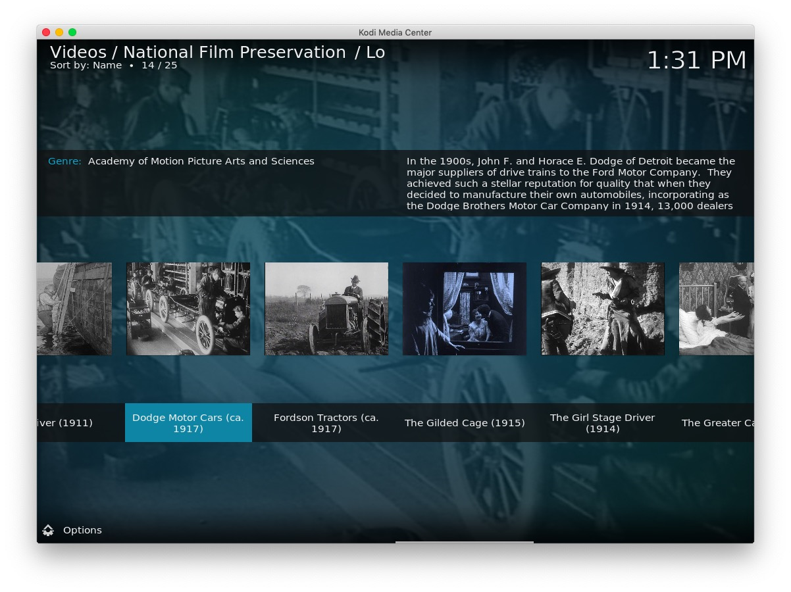
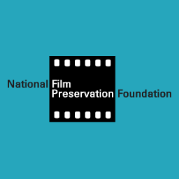
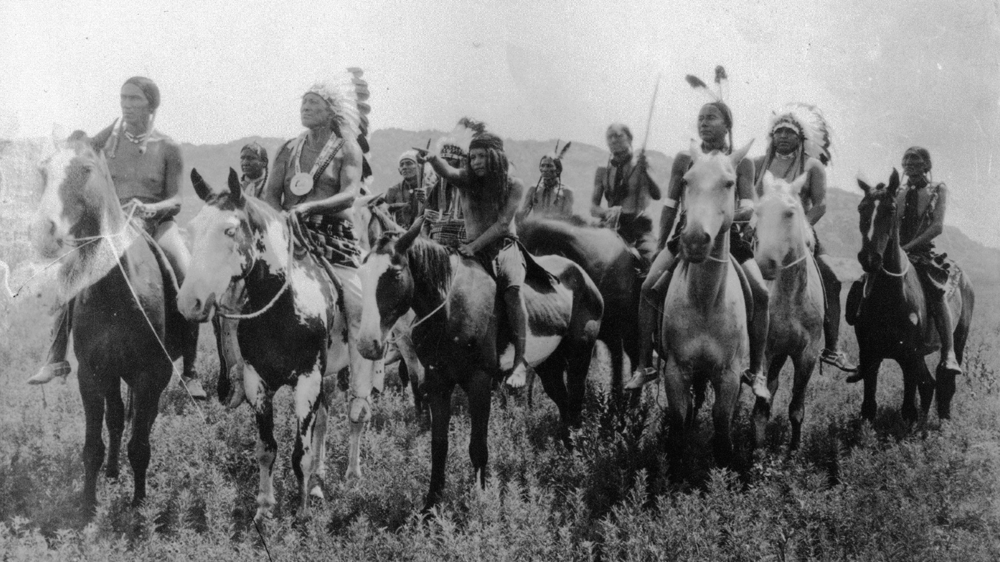

# plugin.video.nfpf

This add-on enables playing of videos and movies from the [National Film Preservation Foundation](https://www.filmpreservation.org/) website.

*   Shows sections such as; Treasures from American Film Archives, Saved Through the NFPF, etc
*   Allows searching the archive and saved searches
*   Caches recently viewed files for fast replay 

[Donations for this add-on gratefully accepted](https://www.paypal.me/fraserchapman)

## The Collection

> "The National Film Preservation Foundation is the nonprofit organization created by the U.S. Congress to help save America's film heritage.
> We support activities nationwide that preserve American films and improve film access for study, education, and exhibition."

[About the National Film Preservation Foundation](https://www.filmpreservation.org/about/about-the-nfpf)

## Disclaimer 

This add-on is not created, maintained or in any way affiliated with the National Film Preservation Foundation.
It only provides an interface to access the free content from the National Film Preservation Foundation website from Kodi.

## Screen Shots

## Licence 

All art work, code and data is provided under an [MIT License](LICENSE.txt)
Except the two images icon.png and fanart.jpg

[National Film Preservation Foundation - Fair use](https://www.filmpreservation.org/)

[National Film Preservation Foundation / Fair use](https://www.filmpreservation.org/blog/tags/orphan%20film%20spotlight)

