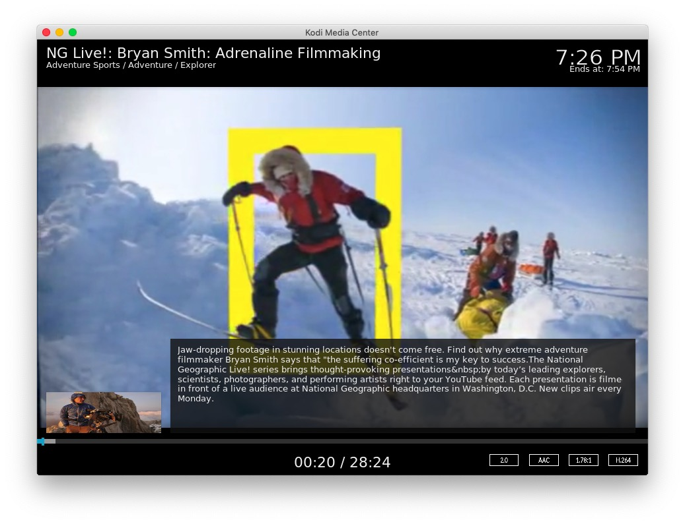
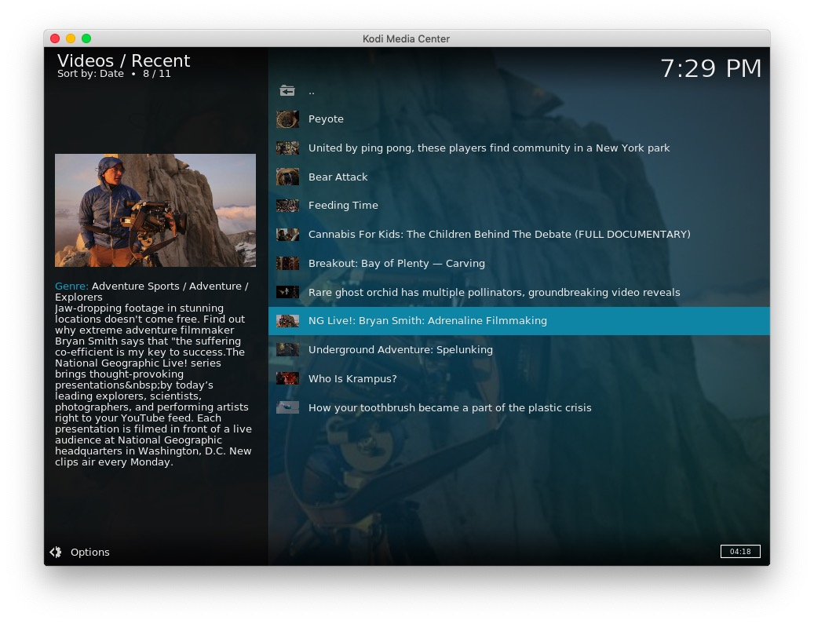
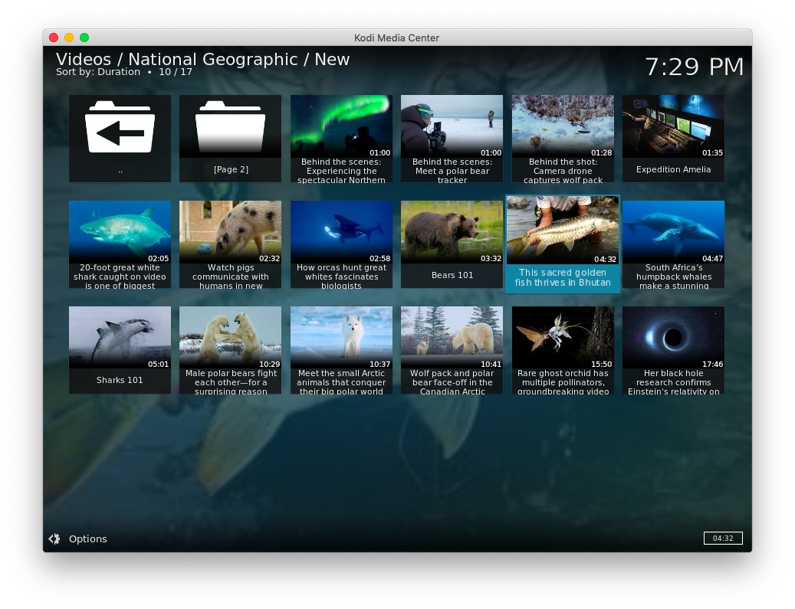
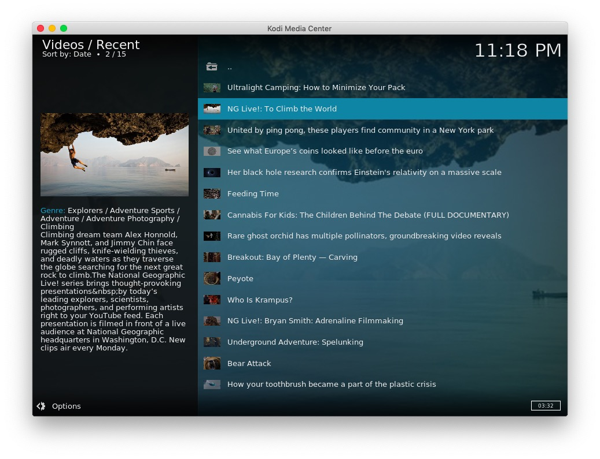
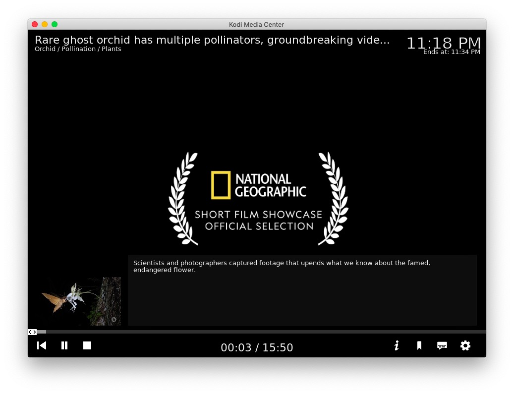

# plugin.video.ng

This add-on enables playing of videos and movies from the [National Geographic](https://www.nationalgeographic.com/) website.

*   Shows sections such as; Shows, Categories, New, Recent, etc
*   Features shows such as; National Geographic Live, Crittercam, World's Deadliest, Zero to 60, etc
*   Allows searching the archive and saved searches
*   Caches recently viewed files for fast replay 

[Donations for this add-on gratefully accepted](https://www.paypal.me/fraserchapman)

## The Collection

> "National Geographic has been igniting the explorer in all of us for 131 years through groundbreaking storytelling from the best and brightest scientists, explorers, photographers, and filmmakers in the world.
Our yellow border serves as a portal to explore the farthest reaches of the Earth and beyond. Places only National Geographic can take you."

[About the National Geographic Society](https://www.nationalgeographicpartners.com/about/)

## Disclaimer 

This add-on is not created, maintained or in any way affiliated with the National Geographic.
It only provides an interface to access the free content from the National Geographic website from Kodi.

## Screen Shots

## Licence 

All art work, code and data is provided under an [MIT License](LICENSE.txt)

Except the two images icon.png and fanart.jpg

[National Geographic - Fair use](https://video.nationalgeographic.com/)

[Ayla Barroud - Creative Commons Attribution-Share Alike 3.0 Unported license](https://commons.wikimedia.org/wiki/File:Syria_landscape.jpg)

