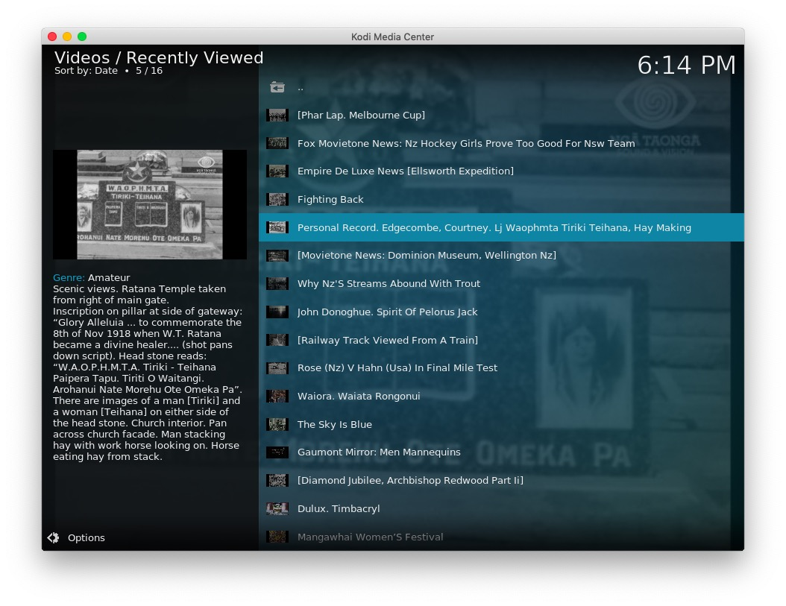
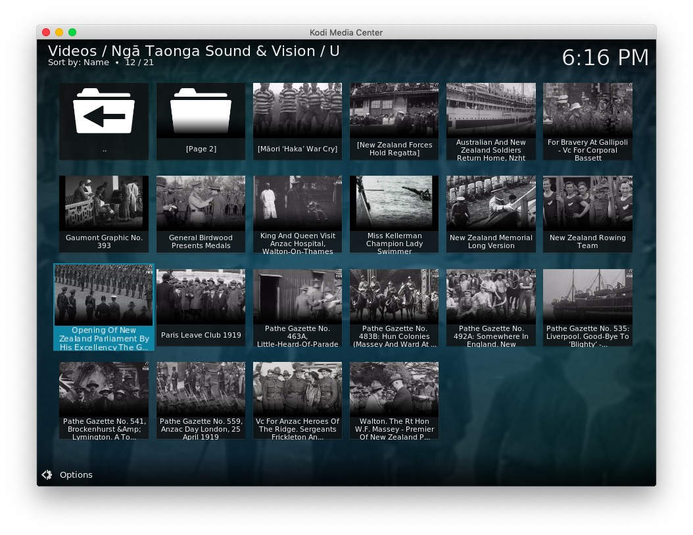
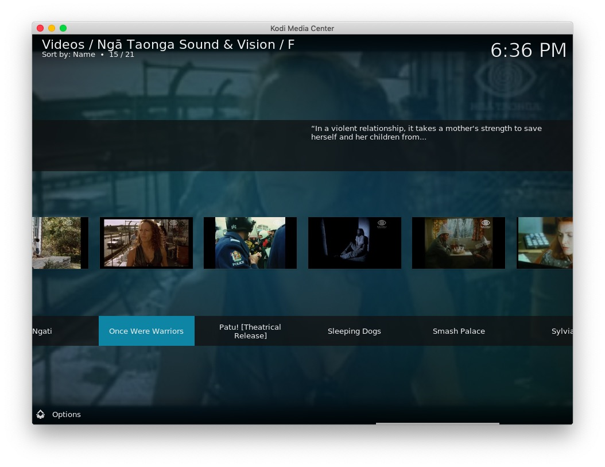
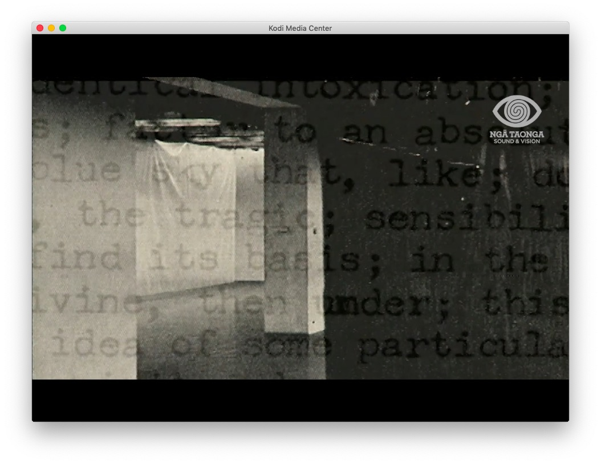
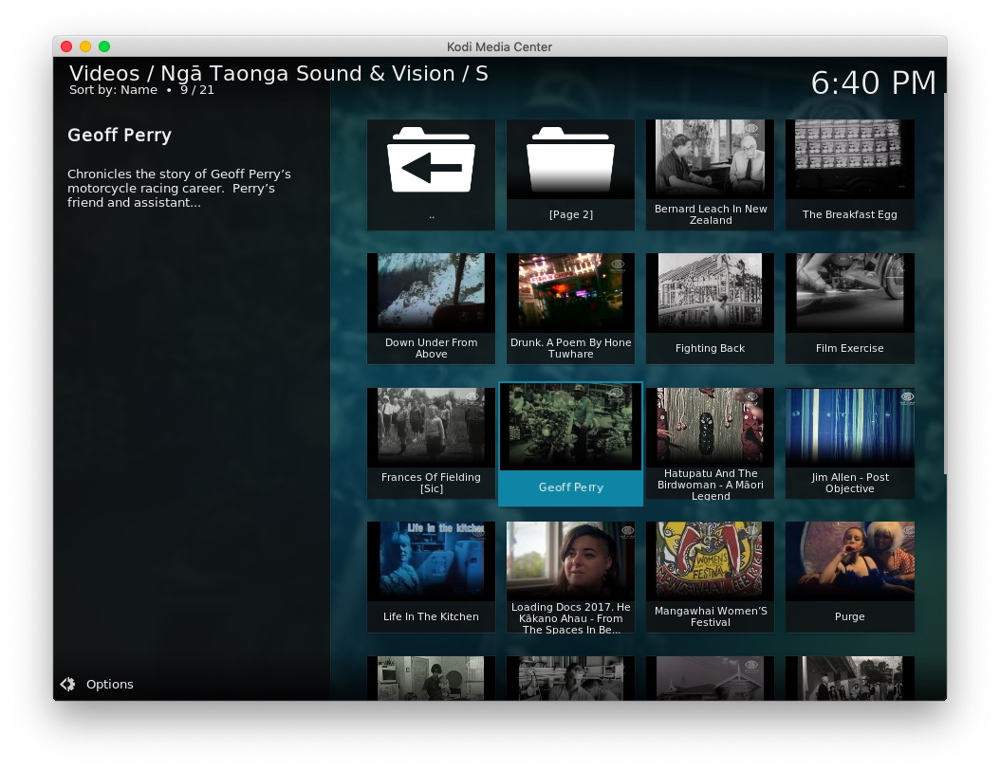

# plugin.video.ntsv

This add-on enables playing of videos and movies from the [Ngā Taonga Sound & Vision](https://www.ngataonga.org.nz/) website.

*   Shows genres such as; Television, Music Video, Short, Feature, etc
*   Shows by date of production
*   Shows by place of production such as; New Zealand/Aotearoa, United Kingdom, France, USA, etc
*   Allows searching the archive and saved searches
*   Caches recently viewed files for fast replay 

[Donations for this add-on gratefully accepted](https://www.paypal.me/fraserchapman)

## The Collection

> "Ngā Taonga Sound & Vision is a charitable trust. We care for an ever-growing collection of films, radio, television, sound recordings, props and documents spanning 120 years of Aotearoa’s sound and moving image history.
> We are committed to the principles of Te Tiriti O Waitangi. We actively develop relationships with whānau, hapū, iwi and Māori organisations to ensure appropriate long-term care of and access to sound and moving image taonga."

[About Ngā Taonga Sound & Vision](https://www.ngataonga.org.nz/about/)

## Disclaimer 

This add-on is not created, maintained or in any way affiliated with Ngā Taonga Sound & Vision.
It only provides an interface to access the free content from the Ngā Taonga Sound & Vision website from Kodi.

## Screen Shots

## Licence 

All art work, code and data is provided under an [MIT License](LICENSE.txt)

Except the images icon.png

[Ngā Taonga Sound & Vision - Fair use](https://ngataonga.org.nz/)

Fanart by Fraser

