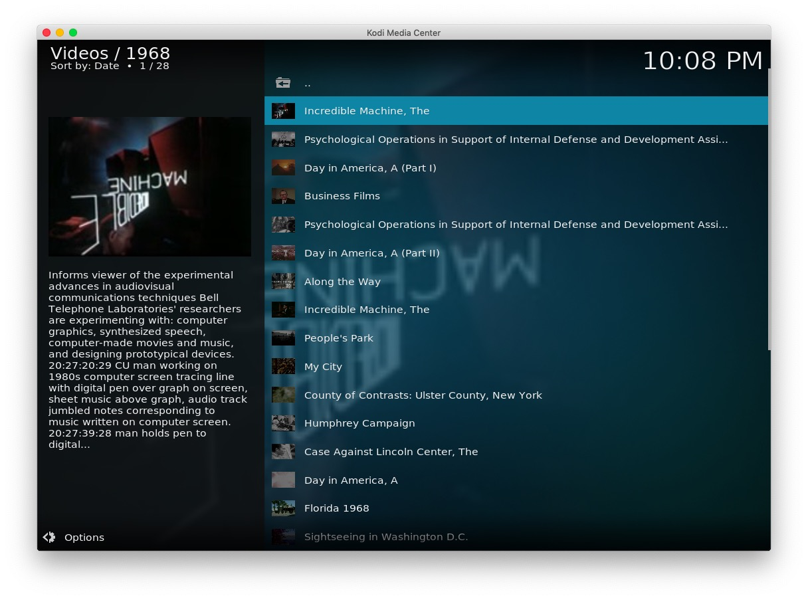
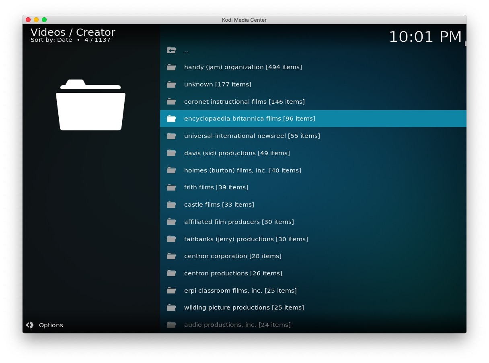
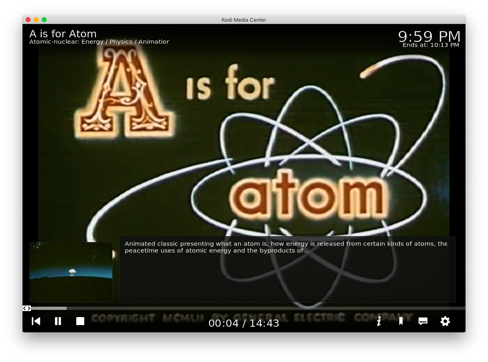
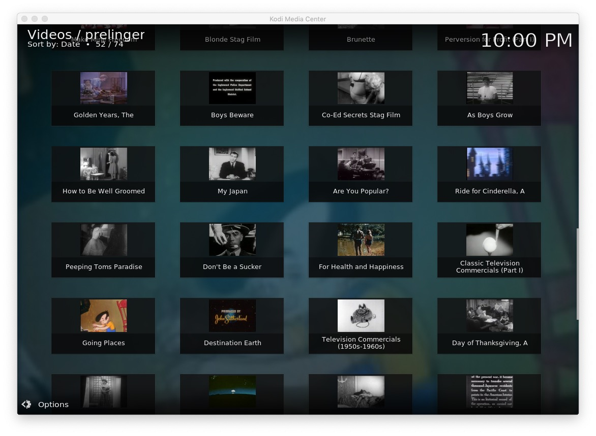
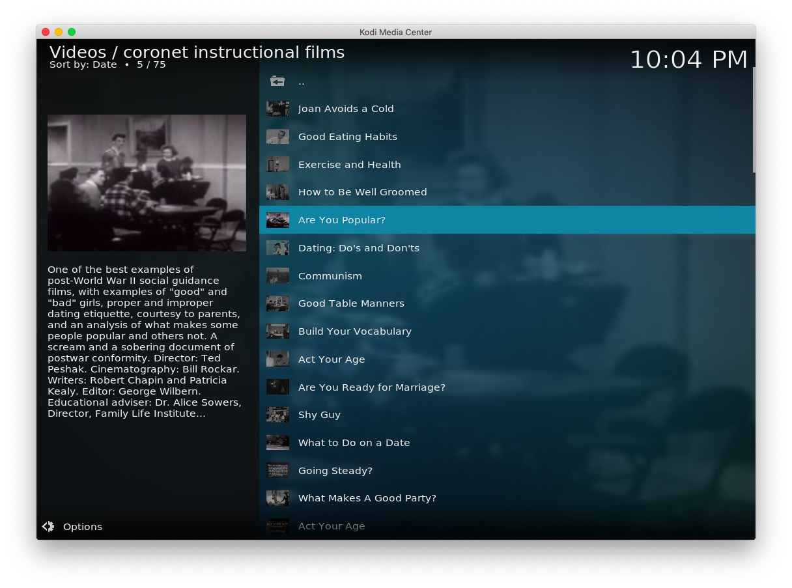
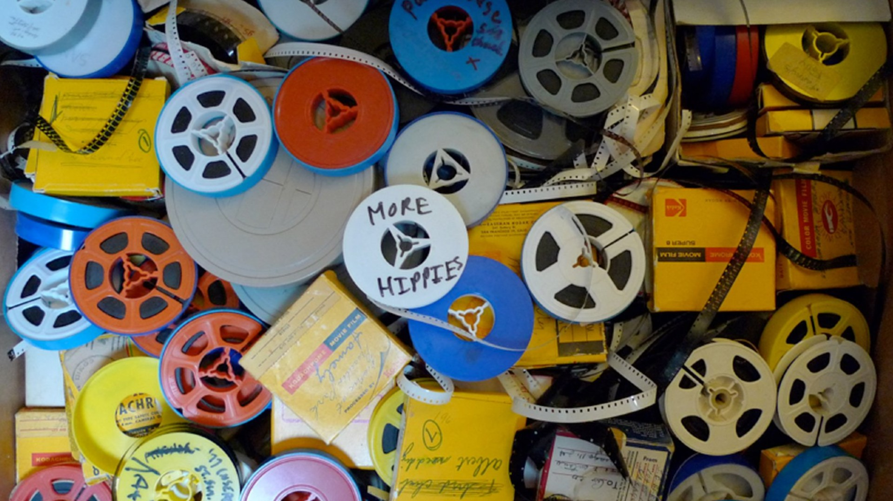

# plugin.video.pa

This add-on enables playing of videos and movies from the [Prelinger Archives](https://archive.org/details/prelinger/) website.

*   Shows topics and subjects such as; Home Movies, Newsreels, Advertising, Amateur films, etc
*   Shows collections by creators; Coronet instructional, Encyclopedia Britannica, Castle films, etc
*   Shows items by period/decade; 1970s, 1980s, etc
*   Allows searching the archive and saved searches
*   Caches recently viewed files for fast replay 

[Donations for this add-on gratefully accepted](https://www.paypal.me/fraserchapman)

## The Collection

Prelinger Archives was founded in 1983 by Rick Prelinger in New York City.
Over the next twenty years, it grew into a collection of over 60,000 "ephemeral" films.

Prelinger Archives remains in existence, holding approximately 11,000 digitized and videotape titles and a large collection of home movies, amateur and industrial films acquired since 2002.
Its primary collection emphasis has turned toward home movies and amateur films, with approximately 17,000 items held as of Spring 2019.
Its goal remains to collect, preserve, and facilitate access to films of historic significance that haven't been collected elsewhere. 

---

Video: "This Is Prelinger Archives"

---

## Disclaimer 

This add-on is not created, maintained or in any way affiliated with the Prelinger Archives.
It only provides an interface to access the free content from the Prelinger Archives from Kodi.

## Screen Shots

## Licence 

All art work, code and data is provided under an [MIT License](LICENSE.txt)

Except the two images icon.png and fanart.jpg

[Prelinger Archives - Fair use](https://archive.org/details/prelinger)

[PBS - Fair Use](https://www.pbs.org/wgbh/americanexperience/features/personalizing-past-interview-rick-prelinger/)

