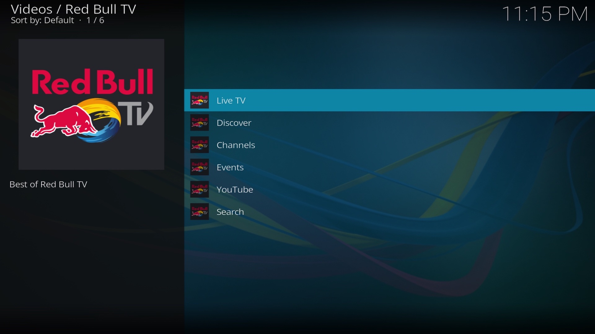
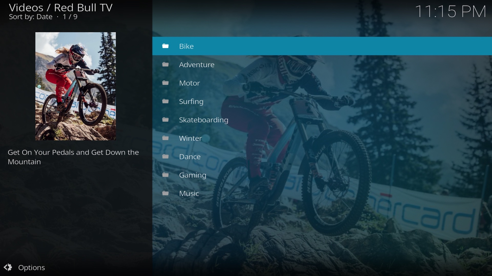
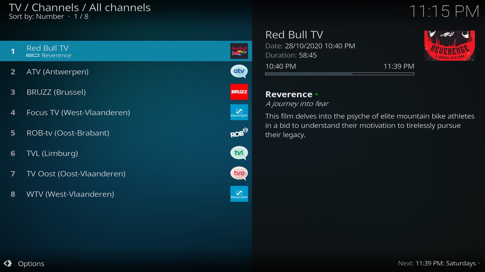
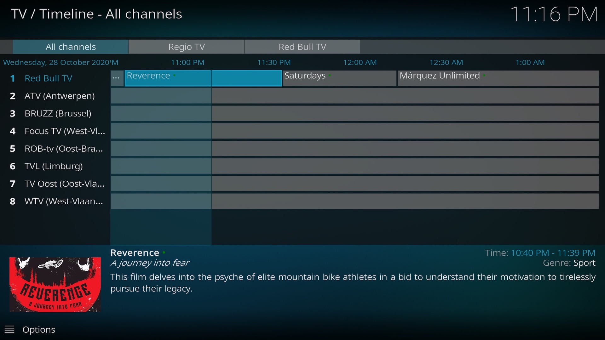

# Kodi add-on for Red Bull TV

**plugin.video.redbull.tv** is a [Kodi](https://kodi.tv/) add-on for watching live streams *and* all video-on-demand
content available on [Red Bull TV](https://www.redbull.com/discover).

## Features

* Live Red Bull TV
* Search
* Watch events live & on-demand
* Browse recommended and featured videos
* Integration with Red Bull YouTube channel
* Integration with TV Guide (via IPTV Manager)
* On-demand playback from TV Guide (context menu)

## Screenshots
<table>
  <tr>
    <td></td>
    <td></td>
  </tr>
  <tr>
    <td></td>
    <td></td>
  </tr>
</table>

## Releases
### v3.2.2 (2021-01-12)
- A fix in the parsing using the new standard for UTC timezone (@dagwiers)
- Improvements to the parsing and logging of these issues in the future (@dagwiers)
- Unit tests to detect EPG issues (test for empty results) (@dagwiers)
- Add GitHub CI workflow for testing EPG issues (@dagwiers)
- Add python 3.9 support (@dagwiers)
- Add descriptions to GitHub CI workflows (@dagwiers)
- Allow installing IPTV Manager from the add-on settings (@michaelarnauts)

### v3.2.1 (2020-10-31)
- Fix OK dialog (@dagwiers)
- Catch missing EPG time markers (@piejanssens)

### v3.2.0 (2020-10-29)
- Support VOD playback from EPG via context menu (@piejanssens)
- Add YouTube integration (@piejanssens)
- Improve channel listing (@piejanssens)
- New add-on icon (@piejanssens)

### v3.1.0
- IPTV Manager support (@piejanssens)

### v3.0.0
→ https://github.com/add-ons/plugin.video.redbull.tv
- Harder, Better, Faster, Stronger (@piejanssens)

### v2.0.2 (2018-01-12)
- Fix redirects (@andy-g)
- Migrate from strings.xml to strings.po (@andy-g)

### v2.0.1 (2017-10-22)
- Update API (@andy-g)

### v2.0.0 (2017-10-21)
- Initial commit to official Krypton repository (@andy-g)

### v0.1.0 (2017-09-22)
→ https://github.com/andy-g/kodi.plugin.video.redbulltv2
- Moved RedbullTV functionality into a RedbullTV2 Client (@andy-g)
- Add settings to specify preferred video resolution (@andy-g)
- Added Unit Tests (@any-g)
- Added Integration Tests (@andy-g)
- Added Continuous Integration with Travis CI (@andy-g)

### v0.0.5 (2017-04-13)
- Added search function (@nedge2k)

### v0.0.4 (2017-03-23)
- Code cleanup/refactoring (@nedge2k)
- Added thumbnail image and summary to directories (@nedge2k)

### v0.0.3 (2017-03-12)
- Fixed compatibility issue with Kodi forks (like SPMC) using python 2.6 (@nedge2k)
- Added error handling for when the server url errors out (@nedge2k)

### v0.0.2 (2017-03-11)
- Fixed issue with scheduled event streams not appearing in lists (@nedge2k)
- Added plugin icon/fanart (@nedge2k)

### v0.0.1 (2017-03-11)
→ https://github.com/nedge2k/kodi.plugin.video.redbulltv2
- Initial Release

### v1.2.2 (2017-02-04)
- [upd] addon.xml (@NEOhidra)

### v1.2.1 (2015-12-07)
→ https://github.com/NEOhidra/plugin.video.redbull.tv
- [upd] addon.xml (@NEOhidra)

### v1.2.0 (2015-05-15)
- ADD: ask for video quality (optional) (@bromix)
- ADD: caching (@bromix)
- UPD: code cleaning (@bromix)
- UPD: kodion (@bromix)
- FIX: don't provide selectable streams for upcoming live events (@bromix)
- FIX: find LIVE stream (@bromix)

### v1.1.0 (2015-04-26)
- ADD: support for 'Live' events (@bromix)
- ADD: support for 'Replays' and 'Upcoming' events (@bromix)
- ADD: 'Latest Films' (@bromix)
- ADD: 'Recently Added' (@bromix)
- FIX: show correct 'Featured Shows' (@bromix)
- FIX: corrected url for 'Featured' (@bromix)

### v1.0.1 (2015-04-22)
- UPD: public release (@bromix)

### v1.0.0~beta2 (2015-04-21)
- UPD: Optimized navigation in 'sports' (@bromix)

### v1.0.0~beta1 (2015-04-16)
→ https://github.com/bromix/plugin.video.redbull.tv
- ADD: Initial release (@bromix)

### v2.0.5 (2013-11-09)
- Fixed show playback (@AddonScriptorDE)
- Changed show listing (@AddonScriptorDE)

### v2.0.4 (2013-08-11)
- Fixed event playback (@AddonScriptorDE)
- Added autoplay mode for events (@AddonScriptorDE)

### v1.0.3 (2012-07-13)
- Added live events (@AddonScriptorDE)

### v1.0.2 (2012-07-08)
- Added <disclaimer> tag to addon.xml (@AddonScriptorDE)
- Added setting to force view mode (@AddonScriptorDE)

### v1.0.1 (2012-07-08)
- Fixed small bug with wrong labels (@AddonScriptorDE)

### v1.0.0 (2012-07-07)
→ https://github.com/AddonScriptorDE/plugin.video.redbull_tv
- First Try (@AddonScriptorDE)
