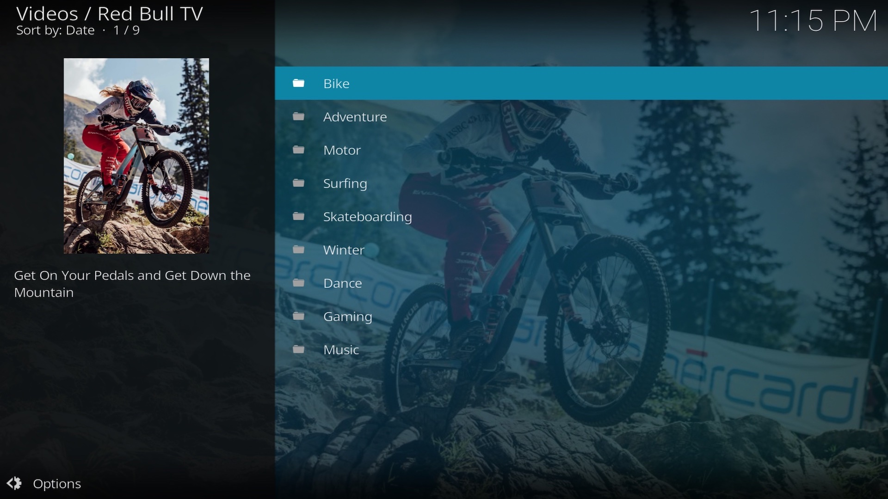

# Kodi add-on for Red Bull TV

**plugin.video.redbulltv** is a [Kodi](https://kodi.tv/) add-on for watching live streams *and* all video-on-demand
content available on [Red Bull TV](https://www.redbull.com/discover).

## Features

* Live Red Bull TV
* Search
* Watch events live & on-demand
* Browse recommended and featured videos
* Integration with Red Bull YouTube channel
* Integration with TV Guide (via IPTV Manager)
* On-demand playback from TV Guide (context menu)

## Screenshots
<table>
  <tr>
    <td></td>
    <td></td>
  </tr>
  <tr>
    <td></td>
    <td></td>
  </tr>
</table>

## Releases
### v3.2.0
- Support VOD playback from EPG via context menu
- Add YouTube integration (requires YouTube add-on)
- Improve channel listing

### v3.1.0
- IPTV Manager support

### v3.0.0
- Harder, Better, Faster, Stronger

### v2.0.2 (2018-01-12)

### v2.0.1 (2017-10-22)

### v2.0.0 (2017-10-21)

### v1.2.2

### v1.2.1

### v1.2.0

### v1.1.0

### v1.0.1

### v0.1.0 (2017-09-22)
- Moved RedbullTV functionality into a RedbullTV2 Client
- Add settings to specify preferred video resolution
- Added Unit Tests
- Added Integration Tests
- Added Continuous Integration with Travis CI

### v0.0.5 (2017-04-13)
- Added search function

### v0.0.4 (2017-03-23)
- Code cleanup/refactoring
- Added thumbnailimage and summary to directories

### v0.0.3 (2017-03-12)
- Fixed compatibility issue with Kodi forks (like SPMC) using python 2.6
- Added error handling for when the server url errors out

### v0.0.2 (2017-03-11)
- Fixed issue with scheduled event streams not appearing in lists
- Added plugin icon/fanart

### v0.0.1 (2017-03-11)
- Initial Release
