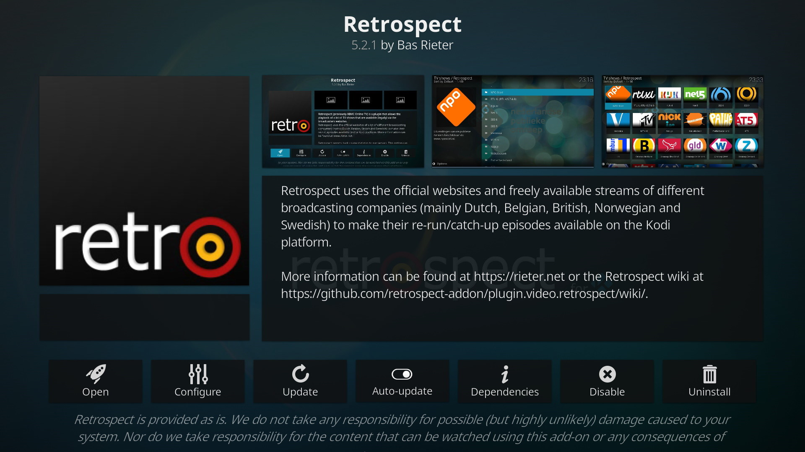

# Retrospect - Public GIT Repository #
[](https://github.com/retrospect-addon/plugin.video.retrospect/releases)
[](https://github.com/retrospect-addon/plugin.video.retrospect/actions)
[](https://sonarcloud.io/dashboard?id=retrospect-addon:plugin.video.retrospect)
[](https://github.com/retrospect-addon/plugin.video.retrospect/blob/master/LICENSE.md)
[](https://kodi.tv/article/attention-addon-developers-migration-python-3)
[](https://kodi.weblate.cloud/projects/kodi-add-ons-video/plugin-video-retrospect/)

This repository holds the main code for Retrospect. For more information on bug reporting, please visit https://github.com/retrospect-addon/plugin.video.retrospect or https://github.com/retrospect-addon/plugin.video.retrospect/wiki.

## Introduction
Retrospect (Previously XBMC Online TV) is a Kodi video add-on which allows you to watch streams of a number of free and publicly available online TV stream sites.

It originally started the streams from [www.uitzendinggemist.nl](https://npostart.nl) which is a Dutch site. The add-on got its initial name from this site: ‘_Uitzending gemist_’ means ‘_missed broadcast_’ in Dutch.

Discussion about the add-on can be done in [this](https://forum.kodi.tv/showthread.php?tid=25522) thread at the Kodi forums or in [this](https://gathering.tweakers.net/forum/list_messages/1643928/last) thread at Tweakers.net (Dutch only). Issues regarding this script can be submitted at our issue tracker at GitHub.

## Installing Retrospect
Starting from Kodi Leia (v18), you can easily install Retrospect from the official Kodi add-on repository. Simply use the search function in the add-ons section to find `Retrospect` and install it. More detailed information can be found in the [Retrospect Wiki](https://github.com/retrospect-addon/plugin.video.retrospect/wiki/Installation).

**Note:** Make sure the _Auto-Update_ option for Retrospect is enabled to automagically receive new updates.



### Kodi Krypton    
We have a -1/+1 Kodi release policy: we support the previous, the current and the future release of Kodi. So with the release of Kodi Matrix, the support for Kodi Krypton has been removed.

## Automation of Retrospect
Listing of folders or playing of media can be automated for Retrospect. In order for this to work, you will need to create _shortcuts_ for the folders and/or videos you want to automate. This can be done as follows:

- On each folder or video item you can go to:
  - Retrospect Favourites.
  - Add Shortcut.
  - Provide a `[simple name]`.
  - Remember the `simple name` as you need it later.
- Then you can use this url to directly open or play the shortcut: 
  - `plugin://plugin.video.retrospect/?action=openshortcut&shortcut=[simple name]`
  
Listing a folder can be done by caling the Kodi API `Addons.ExecuteAddon` with the given shortcut url. Media can be played using the `Player.Open` API.

If you were to use the Kodi JSON-RPC API (documented [here](https://kodi.wiki/view/JSON-RPC_API)) the following are your options:

1. You could start the playback of a media file with `Player.Open`:

```shell
curl -X POST -H "content-type:application/json" http://<kodi-ip>:<kodi-port>/jsonrpc -d '{"jsonrpc": "2.0", "method": "Player.Open", "params": {"item": {"file": "plugin://plugin.video.retrospect/?action=openshortcut&shortcut=<shortcut-name>"}}, "id": 1}'
```
2. Or open a shortcut to a folder with `Addons.ExecuteAddon`:
```shell
curl -X POST -H "content-type:application/json" http://<kodi-ip>:<kodi-port>/jsonrpc -d '{"jsonrpc": "2.0", "method": "Addons.ExecuteAddon", "params": {"addonid": "plugin.video.retrospect","params": {"action": "openshortcut","shortcut": "<shortcut-name>" }}, "id": 1}'**
```

Replace `<shortcut-name>`, `<kodi-ip>` and `<kodi-port>` with the correct values.

## Contributing
You can help develop Retrospect via our [Github](https://github.com/retrospect-addon/plugin.video.retrospect) page and/or help translating Retrospect via the [Kodi Add-on Weblate](https://kodi.weblate.cloud/projects/kodi-add-ons-video/plugin-video-retrospect/).

## Troubleshooting
Visit the [Troubleshooting](https://github.com/retrospect-addon/plugin.video.retrospect/wiki/Troubleshooting) section of the [Retrospect Wiki](https://github.com/retrospect-addon/plugin.video.retrospect/wiki/Installation). There you can find the most common issues and their solutions.

## Acknowledgement
The first idea for Retrospect/XBMC Online TV/XOT-Uzg came from a script by BaKMaN.

## Copyrights and Licenses
Retrospect is licensed under a _GNU General Public License v3.0_, see: [LICENSE.md](./LICENSE.md)

The official add-on package for Retrospect may not be distributed via other repositories than the official Kodi add-on repository.

### Disclaimer ###
Retrospect is not connected to or in any other way affiliated with Kodi, Team Kodi or the XBMC Foundation. Furthermore, any software, addons, or products offered by Retrospect will only receive support in its [Kodi forum](https://forum.kodi.tv/showthread.php?tid=25522) and [Github repository](https://github.com/retrospect-addon/plugin.video.retrospect).

### Rules & Terms ###
As more and more people are starting to make channels for Retrospect, we want to lay out some rules and terms for the channels which we will host. Please stick to them before asking us to merge your work with the master branch:

1. We, the Retrospect team, are not responsible for any content that is displayed using the Retrospect Framework.
1. We, the Retrospect team, do not support any kind of adult content for Retrospect, nor will we host it on our servers.

## Donations
The following persons have supported Retrospect by donating (the list is sorted chronologically):

- David Testas
- Stef Olde Scholtenhuis 
- Gerhard ten Hove 
- J.C. Frerichs 
- Kenny Horbach 
- Laurens De Graaff 
- Stehpan van Rooij
- Niels Walta
- Rene Wieldraaijer
- Bastiaan van Perlo
- Anton Vanhoucke
- Niels van den Boogaard
- Ferry Plekkenpol
- Michel Bos 
- M. Spaans 
- Rogier Duurkoop 
- Jonthe Grotenhuis 
- Maurice van Trijffel 
- Bjorn Stam 
- Prism Open Source 
- Serge Kapitein 
- Robbert Hilgeman 
- Jorn Luttikhold 
- Tom de Goeij
- Gecko (Martijn Pet)
- Henri Lier 
- Edwin Endstra 
- Fabian Labohm 
- Jeroen van den Burg 
- Ronald Geerlings 
- Simon Algera 
- Floris Dirkzwager 
- Jurjen van Dijk 
- J. Tebbes 
- Dennis808 
- Joost Wouterse 
- Slashbot28 
- Jasper Westerhof 
- Jacques Overdijk 
- Ramon Broekhuijzen
- Eymert Versteegt
- Rick van Venrooij 
- Frans Hondeman 
- RSJ Kok 
- Jamie Janssen 
- Thomas Novin 
- Emiel Havinga 
- De php programmeur 
- Tijs Gerritsen  
- Bonny Gijzen
- Dennis van Kapel
- Cameq
- Bart Macco
- Markus Sjöström
- Mathijs Groothuis
- Rene Popken
- KEJ Kamperman
- Angelo Potter
- Athlete Hundrafemtionio
- Dennis Brekelmans
- Ted Backman
- Michiel Klooster
- Webframe.NL
- Jan Willemsen
- Marcin Holmstrom
- Örjan Magnusson
- M H Jongen
- Ola Lindberg
- Elcyion
- Dennis van Kapel
- Pieter Geljon
- Andreas Ljunggren
- Miroslav Puskas
- Floris van de Kamer
- Walter Bressers
- Sjoerd Molenaar
- Patrik Johansson
- Willy van Knippenberg
- Stephan van Rooij
- D J vd Wielen 
- Erik Bots
- Alexander Jongeling
- Robert Thörnberg
- Tom Urlings
- Dirk Jeroen Breebaart
- Hans Nijhuis
- Michel ten Hove
- Rick van Venrooij
- Mattias Lindblad
- Anton Opgenoort
- Jasper van den Broek
- Dick Branderhorst
- Mans Jonasson
- Frans Dijkstra
- Michael Forss
- Dick Verwoerd
- Dimitri Olof Areskogh
- Andreas Hägg
- Oscar Gala y Hondema
- Tjerk Pruyssers
- Ramon de Klein
- Wouter Maan
- Thomas Novin
- Arnd Brugman
- David Kvarnberg
- Jasper van den Broek
- Jeroen Koning 
- Saskia Dijk
- Erik Hond
- Frank Hart
- Rogier Werschkull
- Chris Evertz
- Reinoud Vaandrager
- Lucas van der Haven
- Robert Persson
- Harm Verbeek
- Lars lessel
- Just van den Broecke
- Arvid van Kasteel
- G.F.P. van Dijck
- Thijs van Nuland
- Mathijs van der Kooi
- Michael Rydén
- Jelmer Hartman
- Tirza Bosma
- Tijmen Klein
- Chris de Jager
- Albert Kaufman
- Erik Abbevik
- Scott Beijn
- Peter van der Velden
- Jens Lindberg
- Derek Smit
- Wilbert Schoenmakers
- Bastiaan Wanders
- Maarten Zeegers
- Daan Derksen
- Fredrik Ahl
- Johannes G H de Wildt
- Arthur de Werk
- B van den Heuvel
- Rowan van Berlo
- Chris Neddermeijer
- Willem Goudsbloem
- Videotools.net
- Antoinet.com
- Edwin Eefting
- Marco Bakker
- Fredrik Wendland
- Daniel Harkin
- Pieter Cornelis Brinkman
- Tommy Herman
- Mikael Eklund
- Bob Visser
- Wouter Haring
- Sander van der Knijff
- Edwin Stol
- Eric R Dunbar
- michael kwanten
- Ron Kamphuis
- Marielle Bannink
- F W Jansen
- Harold de Wit
- Jim Bevenhall
- Max Faber
- Remon Varkevisser
- Thomas Lundgren
- Arjan Dekker
- Herman Greeven
- Dick Branderhorst
- Joris Overzet
- Hans Voorwinden
- Matthijs Engering
- Andreas Limber
- Igor Jellema
- Henric Ericsson
- Vardan Sarkisian
- Stefan Zwanenburg
- Dirk Jeroen Breebaart
- Paul Versteeg
- Wim Til
- Op Vos
- Jason Muller
- Roland Hansen
- Jeffrey Allen
- Michel van Verk
- Marcel Van Dijk
- Dimitri Huisman
- Peter Werkander
- Mikael Eriksson
- Martin Wikstrand
- Arjan de Jong
- Jan-Åke Skoglund
- Eric Smit
- G.F.P. van Dijck
- Jan Papenhove
- Herman Driessen
- Matias Toftrup
- Bob Langerak
- Martien Wijnands
- Mark Oost
- Chris Evertz
- David Embrechts
- Roeland Koevoets
- John Poussart
- Pieter Geljon
- Josef Gårdstam
- Paul Moes
- Marco Beeren
- Bulent Malgaz
- G Hosmar
- Robert Klep
- Bas van Marwijk
- Thomas Pettersson
- Peter Oosterhoff
- Alexander Kleyn van Willigen
- Onno Ruijsbroek
- Cornelis Pasma
- Roy van Hal
- Henrik Sjöholm
- Christian Ahlin
- Gerben Roest
- Koen Vermeulen
- Christian Koster
- Johan Bryntesson
- Freek Langeveld
- Jasper Koehorst
- Jaco Vos
- Carolina Tovar
- Mats Nordstrom
- Geert Jan Kalfsbeek
- Martin Alvin
- Anders Sandblad
- Bas van Deursen
- S Goudswaard
- Ruben Jan Groot Nibbelink
- Rogier van der Wel
- Arjen de Jong
- Theo Schoen
- Vincent Muis
- Ruth de Groot
- Nils Smits
- Martin Tullberg
- Lucas Weteling
- Nico Olij
- Josef Salberg
- Remco Lam
- Ton Engwirda
- Vincenzo messina
- Stephanus René van Amersfoort
- Rikard Palmer
- Russell Buijsse
- Geert Bax
- Hermandus Jan Marinus Wijnen
- Martijn Boon
- F.M.E.J Huang
- Mikael Eriksson
- Maryse Ellensburg
- Balder Wolf
- Koen Mulder
- Jan Riemens
- Koos Stoffels
- Rob van Houtert
- Samuel Zayas
- Jos Verdoorn
- Patric Sundström
- Henrik Nyberg
- Thetmar Wiegers
- Marco Kerstens
- Richard Willems
- Henk Haan
- Michel van Verk
- Hans Filipsson
- Magnus Bertilsson
- Sean Berger
- LHM Damen
- Theo Jansen
- René Mulder
- Andrei Neculau
- Fred Selders
- Alfred Johansson
- Adri Domeni
- Peter Adriaanse
- Andre Verbücheln
- Frank Kraaijeveld
- Thomas Stefan Nugter
- Robert Mast
- Daniel Skagerö
- Christian Jivenius
- Joost Vande Winkel
- Johan Asplund
- Björn Axelsson
- Gunilla Westermark
- Tobbe Eriksson
- Bram De Waal
- Michiel Ton
- Hans Filipsson
- Micha Van Wijngaarden
- Daniel Sandman
- Johan Johansson
- Andreas Rehnmark
- Jan Den Tandt
- Theo Schoen
- Daniel Skagerö
- Robert Rutherford
- Ulf Svensson
- Bert Olsson
- Svante Dackemyr
- Koen Bekaert
- Rob Hermans
- Marcin Rönndahl
- Robert Smedjeborg
- Bo Johansson
- Olivier De Groote
- Robin Lövgren
- Koen Bekaert (second donation!)
- Mahamed Zishan Khan
- Tom Mertens
- Stian Ringstad
- Per Arne Jonsson
- Niels Van den Put
- Jan Tiels
- Theo Schoen
- Anton Driesprong
- Bart Coninckx
- Rogier Versluis
- Bo Johansson
- Ola Stensson
- Mathijs Groothuis
- Sune Filipsson
- Leif Ohlsson
- Benjamin Jacobs
- Koen De Buck
- Hans Filipsson
- Dejan Dozic
- Roeland Vanraepenbusch
- Brick by Brick
- Gerrit Halfwerk
- Johan Asplund
- Ketil Thorgersen
- Hans Filipsson
- Daniel Skagerö
- Richard Hakansson
- Magnus Holmquist
- Dejan Dozic
- Daniel Eriksson
- Patrik Magnusson
- Anton Driesprong
- Stefan Zetterberg
- Gerrit Halfwerk
- Martin Gustafsson
- Daniel Jonsson
- Stefan
- John-Richard Berkemo
- Andreas Uddén
- Peter Jonsson
- Martijn Abel
- Peter Jonsson
- Tomasz Gross
- Leendert Breukel
- Stian Ringstad
- Fredrik Ostman
- Johan Asplund
- Tim Bont
- Martijn Abel
- R.J. van den Hoogen
- Michiel Modderman
- Magnus Ögren
- Kovit Holding B.V.
- Anne Franssens
- Dejan Dozic
- Jeroen de Vries
- A. Majoor
- John Albregtse
- European IT Security AB
- Carlo Spijkers
- Robin Lövgren
- Roland Smit
- G.L. Lekkerkerk
- P.G.M. Schoonderwoerd
- Gerrit Halfwerk
- M. Prins
- Remco Swart
- Johan Johansson
- Bert Algoet
- Pieter Unema
- Peter Notebaert
- Mjm De Frankrijker
- Kris Provoost (via Brickshop.nl)
- Lord_Drubibu (via World of Tanks) 
- Christian Johansson
- Johan Johansson
- Tpj Mulder
- André De Winkel
- Dejan Dozic
- Henrique Gomes
- Carl Gärde
- Stefan Zetterberg
- Mgj Van Munnen
- Per Karlsson
- Peter Werkander
- Erik Koole
- Robin Lövgren
- Johan Lundin
- Yennick Trevels
- Cor Kuin
- Ingos Data o PPDesign
- Jules Harms
- Reinier 
- Johan Pieter Zoetekouw
- Michiel Modderman
- Nick Corthals
- Henrik Segesten
- Olle Damgaard
- Brecht Serckx
- Sape Sikkema
- Gialt Huininga
- Petra Pahtajärvi
- Marcus Bruzelius
- T.R. Quuk
- M.J.M. de Frankrijker
- Magnus Holmquist
- P G M Schoonderwoerd
- Jasper-Laurens Van Daele
- Olle Brink
- Magnus Bertilsson
- Per-Eric Larsson
- Arjen Heidinga
- Jim Altis
