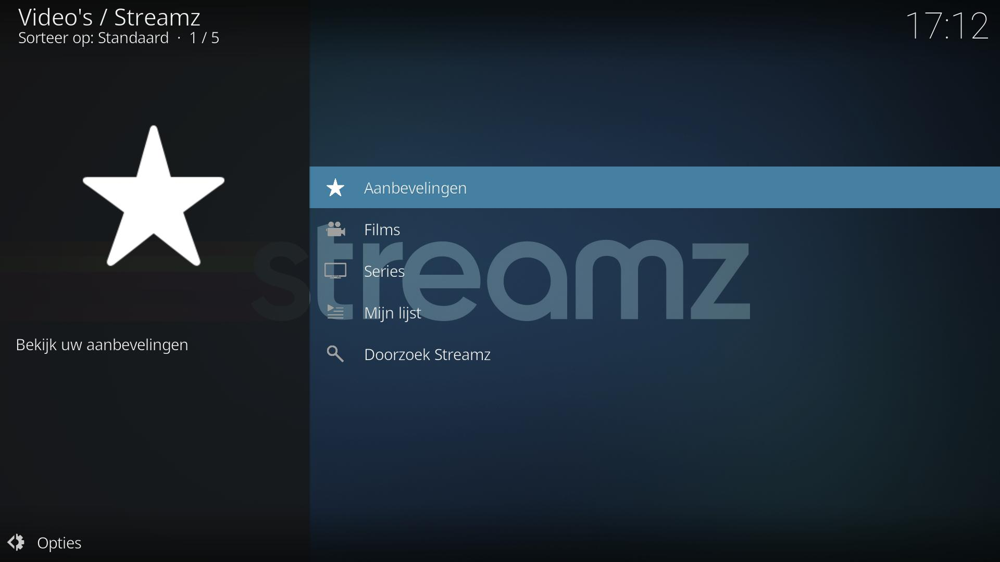
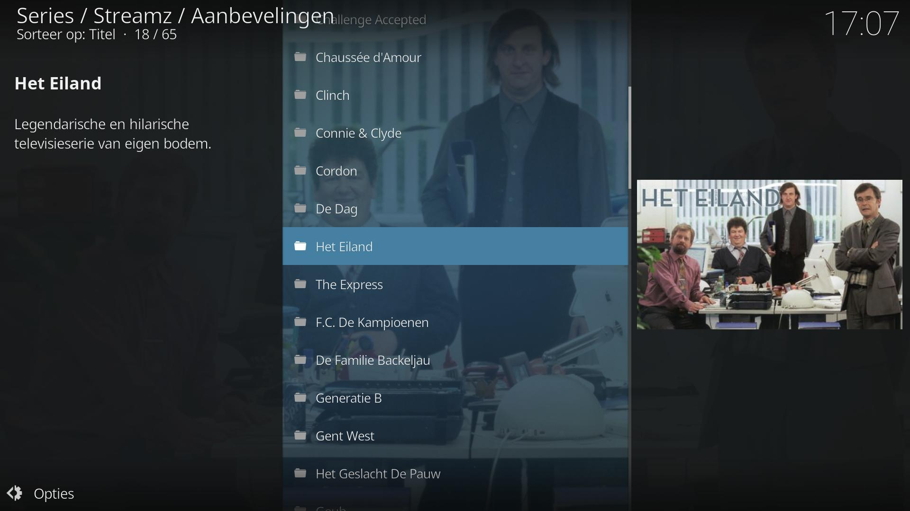

# Streamz Kodi Add-on

*plugin.video.streamz* is een Kodi add-on om naar de catalogus van Streamz te kijken. 

> Note: Je hebt hiervoor een betalend abonnement nodig van [Streamz](https://www.streamz.be/), of een Play More of Yugo abonnement bij Telenet.

Meer informatie kan je vinden op de [Wiki pagina](https://github.com/add-ons/plugin.video.streamz/wiki).

## Features

De volgende features worden ondersteund:
* Afspelen van films en series
* Volledig overzicht van alle content
* Zoeken in de volledige catalogus

## Screenshots

<table>
  <tr>
    <td></td>
    <td></td>
    <td></td>
  </tr>
 </table>

## Disclaimer

Deze add-on wordt niet ondersteund door Streamz BV, en wordt aangeboden 'as is', zonder enige garantie.
Streamz is een merk van Streamz BV, een joint-venture tussen Telenet en DPG Media.
