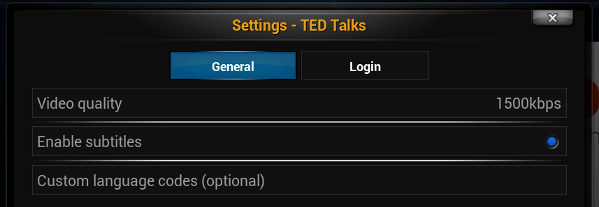

xbmc-plugin.video.ted.talks
===========================
This is a fork of the project started by rwparris, see
[here](http://forum.xbmc.org/showthread.php?tid=36866).

For installation instructions see
[Installing](https://github.com/moreginger/xbmc-plugin.video.ted.talks/wiki/Installing)

The goal is (_surprise_) to allow watching TED talks in XBMC.
The currently supported browsing options are:
* Newest talks
* Search
* Speakers
* Topics

Settings
========

__Video quality__: Set your preferred video bitrate (quality).
If the video isn't available at that bitrate then the default (320kbps) will be used.

__Enable subtitles__: Check this option to show subtitles.
By default the subtitles will be shown in the current XBMC language.

__Custom language code__: Set a custom language code (ISO639-1) if required.
It is also possible to enter a comma separated list of language codes (e.g. _pt-br,pt,en_)
which will show subtitles in the first language which matches.

Bugs
----
Known bugs and enhancement suggestions are tracked
[here](https://github.com/moreginger/xbmc-plugin.video.ted.talks/issues).
