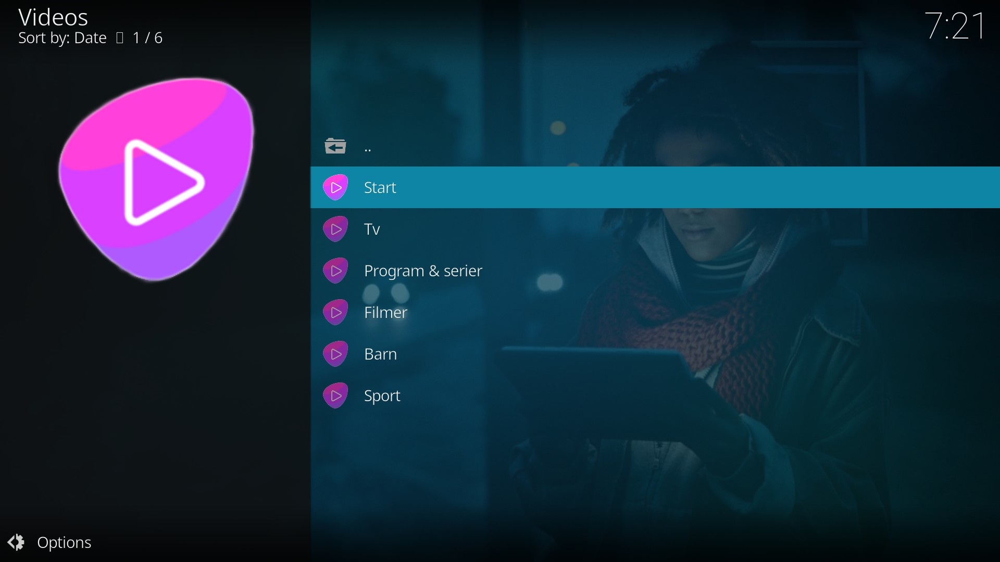
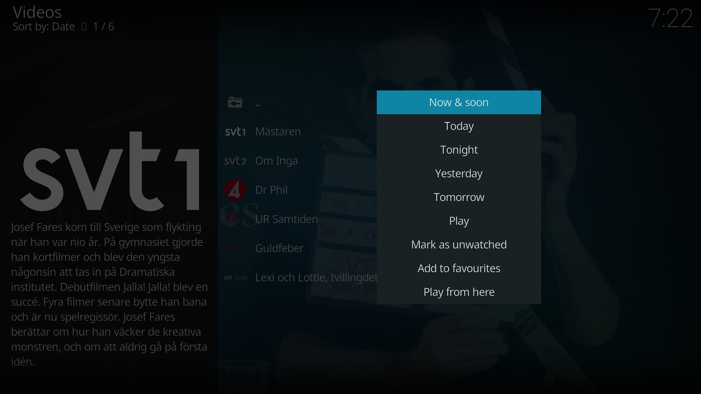
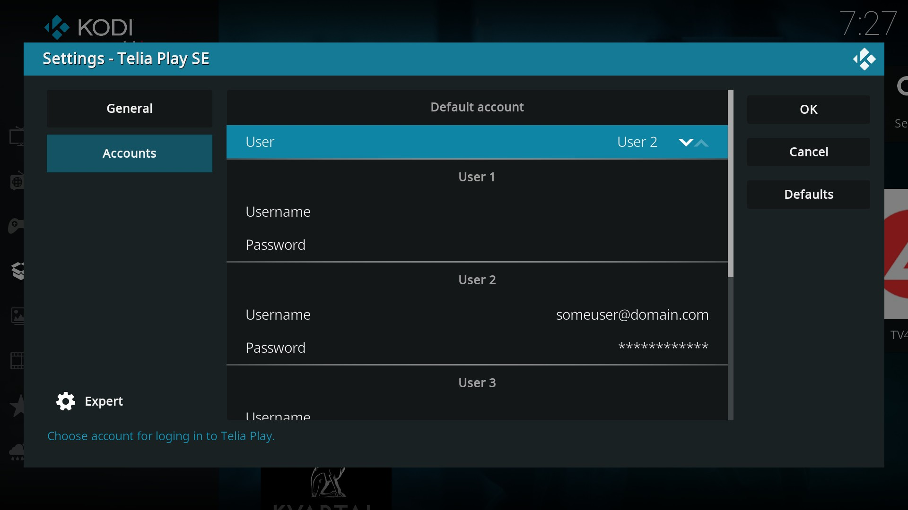

# Telia Play SE
Kodi add-on for watching content provided by https://www.teliaplay.se. It requires a Telia Play SE account.

* Features
	* Stream content provided by Telia Play SE
	* Watch trailers
	* Purchase movies and series through the Telia Play store
	* Switch between multiple users
	* Add or remove items in Min Lista
	* Search history

## Usage
To get started, enter your Telia Play SE credentials into one of the account fields in the settings menu and set the default user accordingly. The add-on supports storing up to five accounts simultaneously; switching between accounts is done through the settings menu.

## Screenshots
<table>
  <tr>
    <td></td>
    <td></td>
    <td></td>
    <td></td>
  </tr>
 </table>

## Disclaimer
This add-on is unofficial and its author has no affiliation with https://www.teliaplay.se.

## Additional notes
The add-on only supports Telia Play SE.

## Contact
email: andrelofgren@hotmail.co.uk.
