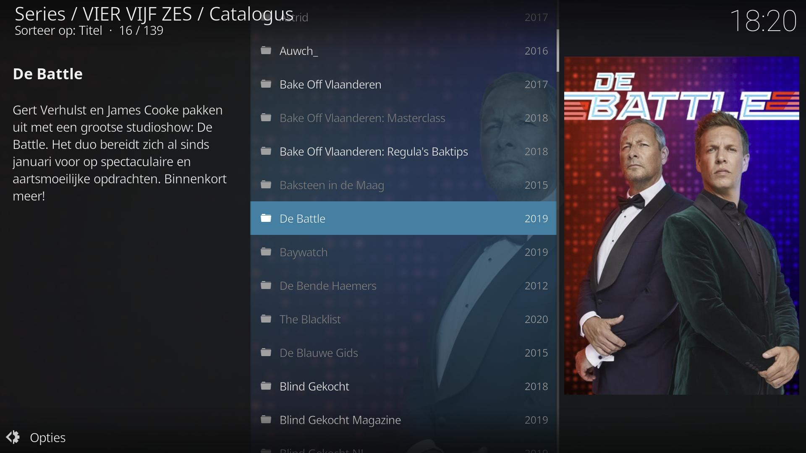
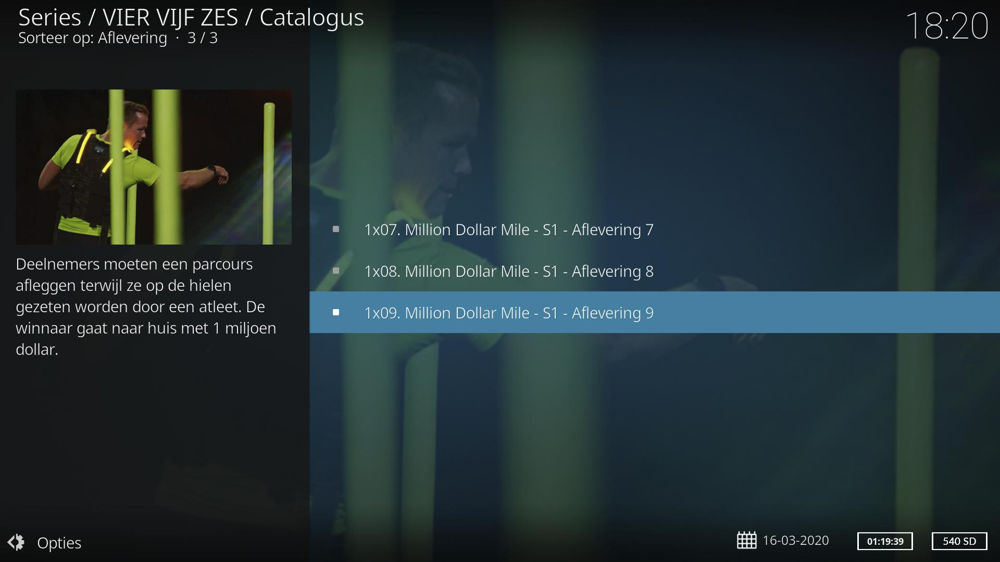
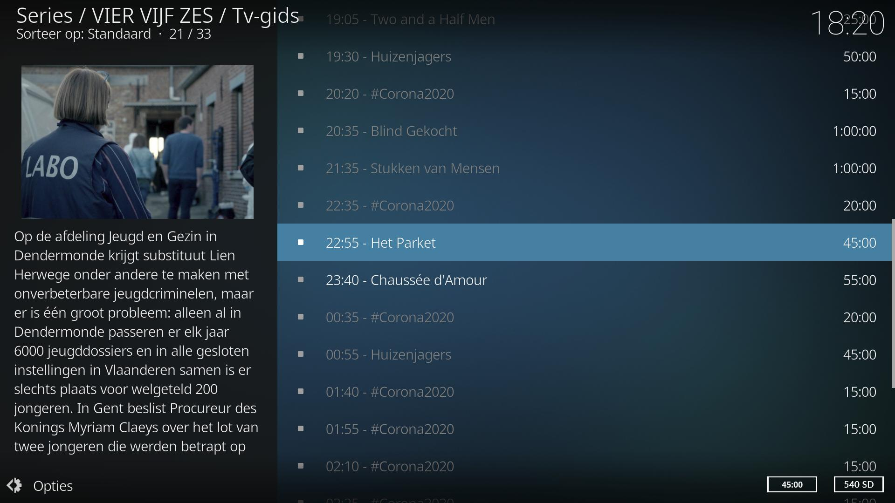

# GoPlay Kodi add-on

*plugin.video.viervijfzes* is een Kodi add-on om de video-on-demand content van [GoPlay](https://www.goplay.be/) te bekijken. Je moet hiervoor wel eerst een
account aanmaken op [goplay.be](https://www.goplay.be/).

Meer informatie kan je vinden op de [Wiki pagina](https://github.com/add-ons/plugin.video.viervijfzes/wiki).

> Let op dat er geen live-streams beschikbaar zijn op het GoPlay platform en je dus enkel kan kijken naar de beschikbare programma's in de catalogus.

## Features

De volgende features worden ondersteund:
* Bekijk on-demand content van Play4, Play5, Play6 en Play7
* Programma's rechtstreeks afspelen vanuit de tv-gids
* Doorzoeken van alle programma's
* Afspelen van gerelateerde Youtube content
* Integratie met [IPTV Manager](https://github.com/add-ons/service.iptv.manager)

## Screenshots

<table>
  <tr>
    <td></td>
    <td></td>
    <td></td>
  </tr>
 </table>

## Disclaimer

Deze add-on wordt niet ondersteund door SBS Belgium, en wordt aangeboden 'as is', zonder enige garantie.
De logo's van GoPlay, Play4, Play5, Play6 en Play7 zijn eigendom van SBS België.
