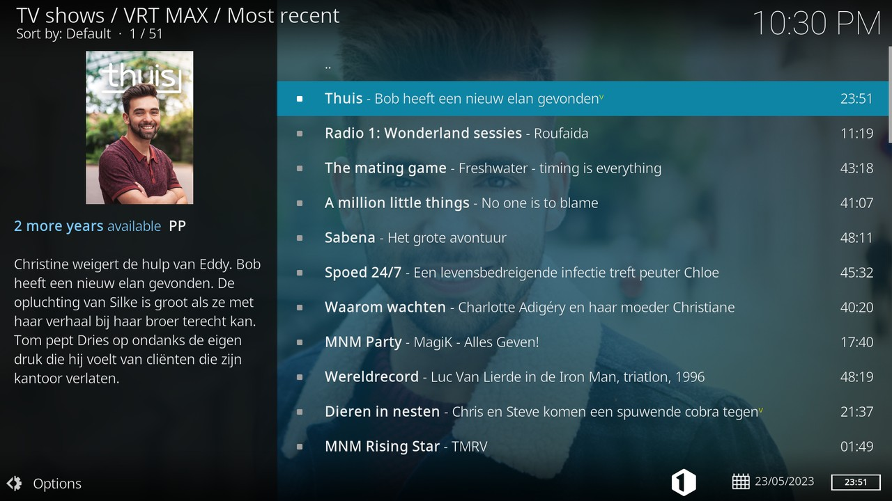
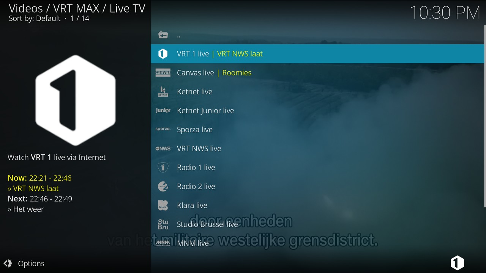
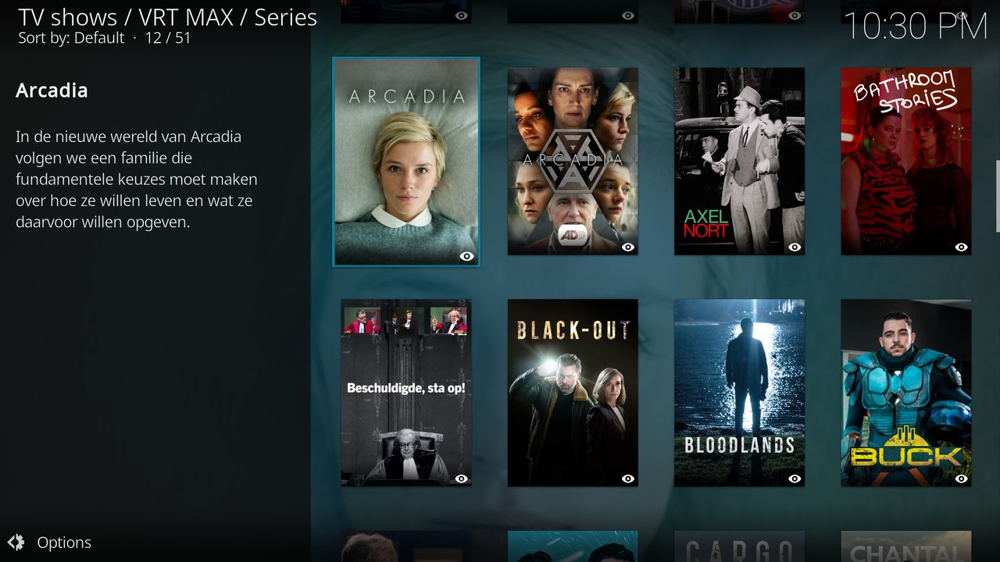
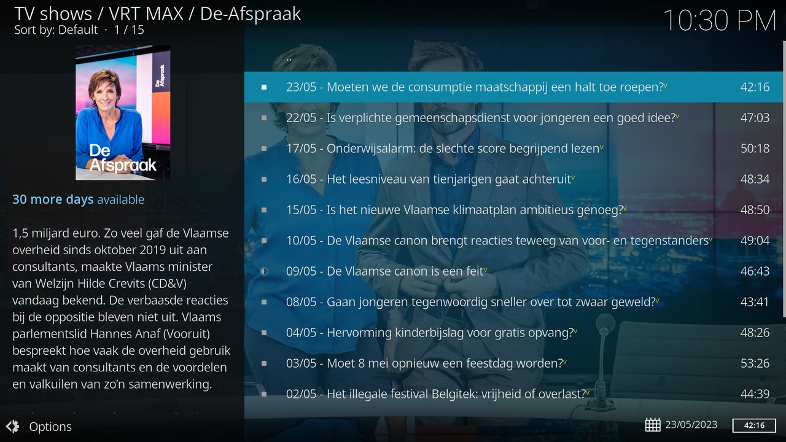

# VRT NU Kodi add-on
**plugin.video.vrt.nu** is a [Kodi](https://kodi.tv/) add-on for watching all live video streams *and* all video-on-demand
content available on [VRT NU](https://vrt.be/vrtnu/).

VRT NU is the video-on-demand platform of VRT, Flanders' public broadcasting service.

This Kodi add-on can be used to watch all video content from VRT NU.

- Track the programs you like
- List all videos alphabetically by program, category, channel or feature
- Watch live streams from Eén, Canvas, Ketnet, Ketnet Junior and Sporza
- Discover recently added or soon offline content
- Browse the online TV guides or search VRT NU

> Note: The VRT NU add-on is not endorsed by VRT, and is provided 'as is' without any warranty of any kind.

## Installing
In Kodi, simply search the add-ons for `VRT` and install the VRT NU video add-on.

> Note: Detailed information about installing and updating the VRT NU add-on is available on [our Wiki](https://github.com/add-ons/plugin.video.vrt.nu/wiki).

## Using the plugin
The [VRT NU](https://vrt.be/vrtnu) platform requires users to sign in before gaining access to video-on-demand content.
Users can sign in with a user name and password, or sign in with their Google, or Facebook account.

This plugin currently only supports signing in using the first method (user name and password). If you already
have a VRT NU account and sign in with another method, it is easy to get a password:

- Sign out of your VRT NU account;
- Click **Inloggen met e-mail**;
- Click the **Wachtwoord vergeten?** hyperlink, and enter your email address.

You will receive an email that allows you to set a password. Use this password to enter in the plugin when
prompted.

> For more information about the VRT NU Kodi add-on, look at [our GitHub Wiki page](https://github.com/add-ons/plugin.video.vrt.nu/wiki).

## Reporting issues
You can report issues at [our GitHub project](https://github.com/add-ons/plugin.video.vrt.nu) or
leave a message at [our Facebook page](https://facebook.com/kodivrtnu/).

## Screenshots
<table>
  <tr>
    <td></td>
    <td></td>
  </tr>
  <tr>
    <td></td>
    <td></td>
  </tr>
</table>

## Releases
### v2.5.9 (2022-04-20)
- Fix broken menu listings (@mediaminister)

### v2.5.8 (2022-04-14)
- Fix watching VRT NU abroad (@mediaminister)
- Fix webscraping video attributes (@mediaminister)

### v2.5.7 (2022-01-31)
- Fix watch later (@mediaminister)
- Fix favorites (@mediaminister)

### v2.5.6 (2021-12-22)
- Fix watching VRT NU abroad (@mediaminister)
- Fix resumepoints (@mediaminister)
- Update featured menu (@mediaminister)

### v2.5.5 (2021-09-09)
- Fix broken menu listings (@mediaminister)

### v2.5.4 (2021-07-21)
- Fix login (@mediaminister)
- Use Widevine DRM by default (@mediaminister)

### v2.5.3 (2021-05-13)
- Fix watching age restricted content (@mediaminister)

### v2.5.2 (2021-04-21)
- Fix broken menu listings (@mediaminister)

### v2.5.1 (2021-04-07)
- Fix season labels (@mediaminister)

### v2.5.0 (2021-03-29)
- Add new categories to featured menu (@mediaminister)

### v2.4.5 (2021-02-05)
- Fix watching livestreams with DRM enabled (@mediaminister)
- Warn user that InputStream Adaptive is needed for timeshifting (@siemon-geeroms)

### v2.4.4 (2021-01-25)
- Fix watching VRT NU abroad (@mediaminister)

### v2.4.3 (2021-01-22)
- Add new channel "Podium 19" (@dagwieers)
- Add livestream cache to speed up playback (@mediaminister)
- Use InputStream Adaptive to play HLS (@mediaminister)
- Don't log credentials in the Kodi debug log (@michaelarnauts)

### v2.4.2 (2020-12-18)
- Fix missing seasons (for 'Thuis') in TV Show menu (@mediaminister)
- Fix missing favourite programs in 'My programs' menu (@mediaminister)
- Allow IPTV Manager and Kodi Logfile Uploader installation from add-on settings (@michaelarnauts)
- Updated Categories menu (@dagwieers)
- Fix date parsing on Windows (@michaelarnauts)

### v2.4.1 (2020-10-31)
- Add new category "Nostalgia" (@dagwieers)
- Add poster support (@dagwieers)
- Add product placement and "kijkwijzer" metadata (@mediaminister)
- Get categories from online JSON (@mediaminister)
- Improvements to connection error handling (@dagwieers)
- Improvements to virtual subclip support (@mediaminister)
- Extend soon offline menu to seven days (@mediaminister)
- Improve Up Next support (@mediaminister)

### v2.4.0 (2020-07-18)
- Show error messages when connections fail (@mediaminister, @dagwieers)
- Improve user authentication cache (@mediaminister)
- Fix missing "Worldview" category (@mediaminister)
- Improve playing programs using the TV guide (@mediaminister)
- Improve IPTV Manager support (@michaelarnauts)
- Add user setting to update the VRT NU add-on easily (@dagwieers)

### v2.3.5 (2020-05-27)
- Fix watching VRT NU abroad (@mediaminister)
- Improve and fix user authentication (@mediaminister, @dagwieers)
- Add support for playing from the Guide with IPTV Manager (@michaelarnauts)

### v2.3.4 (2020-05-18)
- Fix token issue caused by new cross-site request forgery (XSRF) checks (@mediaminister)
- Add experimental IPTV Manager support (@dagwieers)
- Always unescape HTML in outline and description (@mediaminister)

### v2.3.3 (2020-04-30)
- Fix Radio 1 livestream (@dagwieers)
- Fix watching VRT NU abroad (@mediaminister)
- Add support for Kodi 19 Matrix "pre-release" builds (@mediaminister)
- Add colour preferences to accomodate light skins (@dagwieers @mediaminister)
- Add a favourites music subsection (@dagwieers)
- Allow editing a search query from search history (@dagwieers)
- Expand TV guide range (@dagwieers)
- Add livestreams for Radio 2 and Klara (@dagwieers @mediaminister)

### v2.3.2 (2020-01-18)
- Fix issues related to categories scraping and caching (@mediaminister)
- Various improvements to TV guide (@dagwieers)

### v2.3.1 (2020-01-14)
- Fix an issue related to type-handling for settings (@dagwieers)
- Fix an issue related to marking played videos as watched when using Up Next (@mediaminister)
- Small fix for livestreams (@mediaminister)
- Improvements to metadata handling specific to Kodi rendering (@dagwieers)
- Support multiple YouTube links per channel (@dagwieers)

### v2.3.0 (2020-01-01)
- Add integration for Up Next add-on (@mediaminister)
- Store resume points and watchlater at VRT NU (@dagwieers, @mediaminister)
- Implement "Continue watching" (@mediaminister)
- Implement "Watch later" (@dagwieers)
- Fixes to "Go to program", "TV guide" and "Live TV" entries (@dagwieers)
- Cosmetic changes to metadata and plot (@dagwieers)
- Fix Python 3.5 support (@mediaminister)

### v2.2.3 (2019-10-01)
- Integrate new inputstreamhelper (@dagwieers)
- Support user paths with unicode characters (@mediaminister)
- Manage My favorites (@dagwieers)
- Improve breadcrumbs support (@dagwieers)
- Various translation fixes

### v2.2.2 (2019-09-01)
- "Go to program" will now got to "All seasons" listing (@dagwieers)
- Rename "My programs" to "My favorites" (@dagwieers)

### v2.2.1 (2019-08-16)
- Small unicode fix in service handler (@mediaminister)
- Implement Kodi-approved thumb removal (@mediaminister)
- Fix broken streamservice webscraper (again) (@mediaminister)

### v2.2.0 (2019-08-14)
- Add breadcrumbs support (@dagwieers)
- Support unicode characters in credentials (@mediaminister)
- Add a 'Go to program' context menu (@mediaminister)
- Fix the ordering of categories and features (@dagwieers)
- New icon and fanart (@mediaminister)
- Fixes to credentials, tokens, favorites and roaming (@mediaminister)
- Fix broken streamservice webscraper (@mediaminister)
- Fix play-by-airdate API interface (@mediaminister)
- Add TV guide to channel menu (@dagwieers)
- Add a context menu to remove search queries from history (@dagwieers)

### v2.1.1 (2019-07-20)
- Fix issue on Kodi v17 (@dagwieers)

### v2.1.0 (2019-07-11)
- Fix an issue with roaming VRT tokens (@mediaminister)
- Start a video by channel/start time (@mediaminister)
- Use notifications for various events related to tokens/cache/credentials (@dagwieers)
- Add YouTube channel support (@dagwieers)
- Add Radio 1 live stream (@dagwieers)
- Improve credential input (@michaelarnauts)

### v2.0.0 (2019-06-30)
- Changes to API calls, THIS BREAKS EXISTING FAVOURITES AND WATCHED ITEMS
- Added "Featured content" menu, with e.g. "Complete season" or "Last chance" (@dagwieers)
- Added "My movies" and "My documentaries" menus (@dagwieers)
- Added "Refresh" to context menu to refresh without cache (@dagwieers)
- New API call to play latest episode of a program, i.e. home automation (@mediaminister)
- Added Live TV entry at the top of channel-menu, convenient for favourites (@dagwieers)
- Mix one-off programs with multi-episode programs (@dagwieers)
- Indicate followed programs using the °-symbol (@dagwieers)
- Improvements to the add-on settings and error messages (@mediaminister)
- Store previous search queries (@dagwieers)
- Small performance/efficiency improvements (@mediaminister)

### v1.10.0 (2019-05-30)
- Performance improvements by caching HTTP requests locally (@dagwieers)
- Fix episode listings with more than 150 items (@mediaminister)
- Add "Soon offline" functionality to track episodes that will be removed (@dagwieers)
- Add TV guide schedule in live stream metadata (@dagwieers)
- Add "My programs" functionality to track your favorite programs (@dagwieers)
- Improvements to stream selection logic (@mediaminister)
- Fix localized date strings for JeOS platforms (@dagwieers)
- Add "Search" functionality in main menu (@dagwieers)
- Add Ketnet Junior 24/7 live stream (@dagwieers)
- Add Kodi "- All seasons" support in season listings (@dagwieers)
- Add 720p live stream support (without DRM) (@dagwieers)
- Extend the "Troubleshooting" settings with logging and caching options (@dagwieers)
- Support bandwidth limitation (useful for mobile internet connections) (@mediaminister)

### v1.9.0 (2019-05-04)
- Add a Channels menu (@dagwieers)
- Add page-browsing in Recent menu, 50 items per page (@dagwieers)
- Fix general performance issue on Raspberry Pi (@mediaminister)
- Add icon support to channel listings (@dagwieers)
- Improvements to streamservice (@mediaminister)
- Add fallback code for web scraping logic (@dagwieers)
- Add Studio Brussel and MNM live streams (@dagwieers)

### v1.8.0 (2019-04-27)
- Fix the menu listings due to the urllib3 update (@dagwieers)
- Add a TV guide menu entry (@dagwieers)
- Add a permalink to the episode plot (optionally) (@dagwieers)
- Avoid getting license url on every request (@mediaminister)
- Improve menu listings order and add menu sort methods (@dagwieers)
- Implement Kodi formatted text conversion (@pietje666)
- Improved login handling (@mediaminister)
- Improve thumbnail/fanart for menu listings (@dagwieers)
- Fixes to remote play (@mediaminister)

### v1.7.1 (2019-03-28)
- Remove the inputstream.adaptive requirement for Krypton

### v1.7.0 (2019-03-26)
- Fix the categories web-scraping (@mediaminister)
- Add full proxy support (@dagwieers)
- Indicate when content will disappear in the next 3 months (@dagwieers)
- Indicate when content is geo-blocked (@dagwieers)
- Add fanart to menus (@dagwieers)
- Fix issue related to missing sound (@mediaminister)
- Improve main menu listing (@dagwieers)
- Use VRT NU search API for most information gathering (@mediaminister)
- Added Dutch translation (@mediaminister)
- Added "Most recent" menu item (@mediaminister)
- Fix roaming for live streams (@mediaminister)
- Add Python 3 compatibility (@dagwieers)
- Added automated testing using Travis CI (@dagwieers)

### v1.6.0 (2019-03-07)
- Use VRT search api (greatly improves stability)
- Fix for users with Non ASCII compatible user path (@pietje666)
- Fix for roaming token (@pietje666)

### v1.5.2 (2019-01-28)
- Bug fix where the vrt token would be stored in a wrong format (@pietje666)
- Inputstream helper for easier widevine installation (@pietje666)
- Token resets when settings are being changed (@pietje666)

### v1.5.1 (2019-01-20)
- Fixed subtitle issue where subtitles would always be visible (@mediaminister)
- Fixed categories (@mediaminister)
- Roaming support added (@mediaminister)

### v1.5.0 (2018-12-27)
- 720p Livestreams when enabling in settings + having kodi 18 + having widevine.dll present (@mediaminister)
- Fixed bug where watched icon was not showing in Kodi 18 (@pietje666)
- Implemented different way of working with subtitles (@mediaminister)

### v1.4.3 (2018-11-07)
- Livestreams working again (@pietje666)

### v1.4.2 (2018-10-11)
- Changed way of working with urls when a season is referring to href="#" (@pietje666)

### v1.4.1 (2018-09-24)
- Adapted plugin to new vrtnu layout for showing multiple seasons (@pietje666)

### v1.4.0 (2018-09-20)
- Using the new vrtnu login method and video services (@pietje666)
- Fixed bug where some videos would not be able to play (@dagwieers)

### v1.3.4 (2018-09-10)
- Fixed A-Z menu to parse the new vrtnu layout (@pietje666)

### v1.3.3 (2018-09-02)
- Fixed bug where some items would not want to play (@pietje666)
- Fixed bug where some videos would only show one episodes while multiple episodes are present (@pietje666)
- Updated Requests and Beautifulsoup modules (@pietje666)

### v1.3.2 (2018-08-03)
- Changed way of selecting multiple episodes, this fixes a bug where the "active" episodes would not be shown (@pietje666)

### v1.3.1 (2018-07-20)
- Changed way of selecting item title for single videos (@pietje666)

### v1.3.0 (2018-07-14)
- Adapted code to new vrtnu website layout, this fixes a bug where only the first episode would be shown while multiple episodes are present (@pietje666)

### v1.2.0 (2018-06-17)
- Changed live streaming mechanism (@pietje666)

### v1.1.2 (2018-06-14)
- New stream links for live streaming (@yorickps)

### v1.1.1 (2018-03-13)
- Fixed bug where seasons do not show when there is one malfunctioning (@pietje666)

### v1.1.0 (2017-12-15)
- Refactored internal code (@pietje666)

### v1.0.0 (2017-10-01)
- Fixed issue where all the videos would not be able to play, implemented new way of getting the streaming urls (@pietje666)
- Fixed bug where a single video would not be listed when there is also a part "ANDEREN BEKEKEN OOK" present (@pietje666)
- New versioning system now starting from 1.0.0 (@pietje666)

### v0.0.7 (2017-09-09)
- Fixed bug where dates were not always shown (@pietje666)

### v0.0.6 (2017-08-06)
- Fixed ordering bug for videos (@pietje666)

### v0.0.5 (2017-07-24)
- Fixed broken Sporza logo (@pietje666)

### v0.0.4 (2017-07-20)
- Added Sporza livestream (@pietje666)
- Added dates to videos (@stevenv)
- Fixed bug where seasons did not get listed (@pietje666)

### v0.0.3 (2017-05-22)
- Fixed broken livestreams (@pietje666)

### v0.0.2 (2017-05-07)
- Fixed installation issue (@pietje666)

### v0.0.1 (2017-05-01)
- Initial working release (@pietje666)

## Donating

