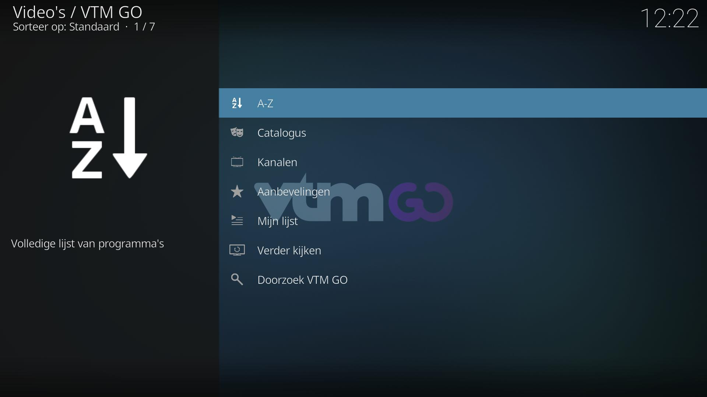
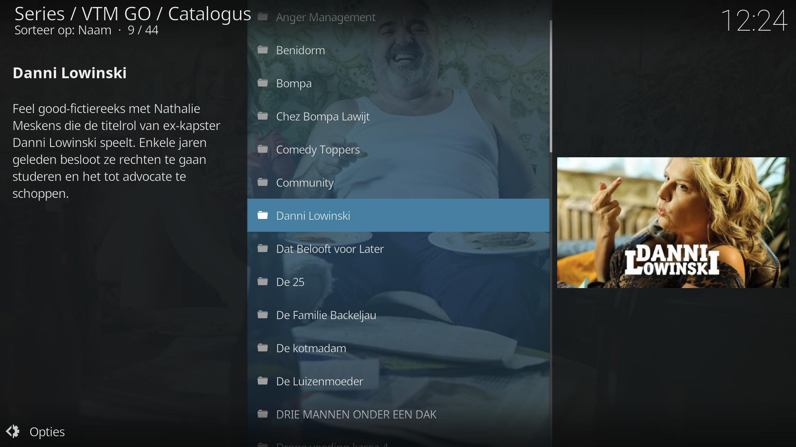
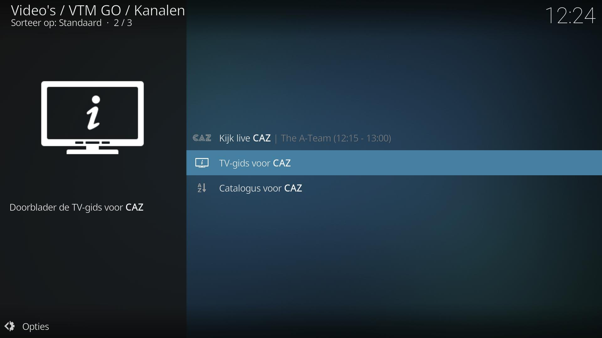

# VTM GO Kodi add-on

*plugin.video.vtm.go* is a Kodi add-on for watching live video streams and video-on-demand content available on the VTM GO platform. 

> Note: You will need to create an account and a profile first on the [VTM GO website](https://vtm.be/vtmgo). This add-on will also play the advertisements that are added to the streams by VTM GO.

## Installation

This is the preferred way to install this addon, since it allows Kodi to automatically update the addon when there is a new version.

1. Go to **Addons**, select **Install from repository** and select the **Kodi Add-on repository**.
1. Go to **Video add-ons** and select **VTM GO**.
1. Hit **Install** in the Addon information screen and follow the instructions.

### Manual installation

You can also download the [latest release](https://github.com/add-ons/plugin.video.vtm.go/releases) or download a [development zip](https://github.com/add-ons/plugin.video.vtm.go/archive/master.zip) from Github for the latest changes.

## Features

The following features are supported:
* User Profiles with access to the specified catalog (VTM GO or VTM GO Kids)
* Watch live TV (VTM, Q2, Vitaya, CAZ, CAZ 2, VTM Kids & QMusic)
* Watch on-demand content (movies and series)
* Browse the VTM GO recommendations and "My List"
* Browse a TV Guide
* Search the catalogue
* Watch YouTube content from some of the DPG Media channels

## Screenshots

<table>
  <tr>
    <td></td>
    <td></td>
    <td></td>
  </tr>
 </table>

## Disclaimer

This add-on is not officially commissioned/supported by DPG Media and is provided 'as is' without any warranty of any kind.
The VTM GO name, VTM GO logo, channel names and icons are property of DPG Media and are used according to the fair use policy.
